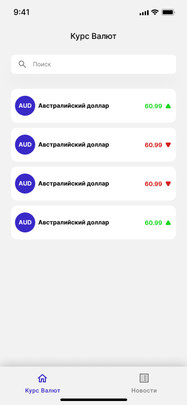
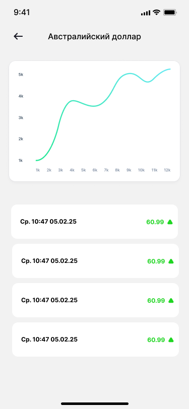
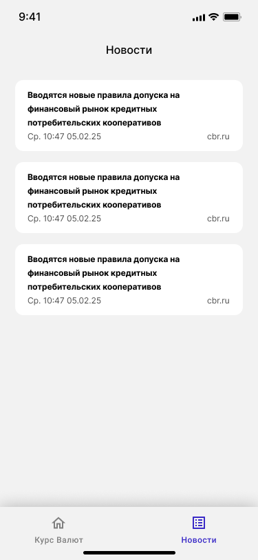
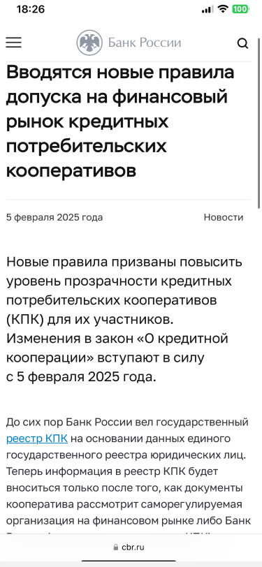
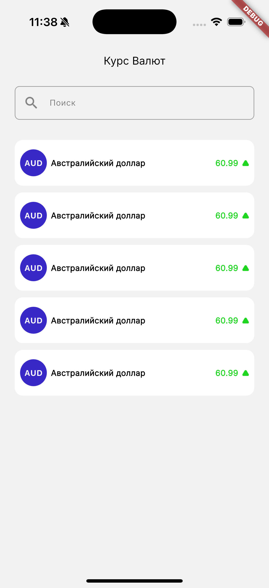

# Лабораторная работа №1. Верстка виджетов

## 1. Описание проекта

В рамках курса будет разработано учебное приложение для Mobile и Web платформ, отображающее текущие курсы валют, получаемые с сайта Центрального банка РФ через API.

## 2. Архитектура проекта

Для организации кода используется **чистая архитектура (Clean Architecture)**. Это позволяет обеспечить хорошую масштабируемость, модульность и тестируемость кода.

Проект условно делится на три слоя:

### domain
- **За что отвечает:** бизнес-логика, модели предметной области, абстракции (интерфейсы).
- **Зачем нужен:** отделяет логику от деталей реализации.

### data
- **За что отвечает:** реализация интерфейсов из domain, получение данных из сети или локального хранилища, парсинг данных.
- **Зачем нужен:** позволяет легко заменить источник данных без изменений в бизнес-логике.

### app (или presentation)
- **За что отвечает:** пользовательский интерфейс, обработка событий, отображение данных.
- **Зачем нужен:** связывает пользователя и бизнес-логику, реализует экранные сценарии.

## 3. Используемые паттерны

### 🧱 Архитектурные паттерны

- **Clean Architecture** — делит проект на независимые слои, упрощая его тестирование и сопровождение.
- **Dependency Injection** — передаёт зависимости (например, репозитории) в классы без жёсткой привязки. В Flutter используется через Provider.

### 📦 Структурные и поведенческие паттерны

- **Repository** — абстрагирует работу с источниками данных (например, сеть или база данных).
- **Observer** — подписывает UI на изменения состояния. Используется во Flutter как часть реактивного программирования.
- **State** — позволяет виджетам изменять поведение в зависимости от состояния (будет рассмотрено в следующей ЛР).

## 4. Дизайн интерфейса

Разработка ведётся под следующие платформы:
- **Mobile (Android / iOS)** — основная цель;
- **Web** - поддержка мобильной верстки и десктопа (самостоятельно).

### Экраны приложения

- **Экран списка валют:** список валют с текущим курсом и поиском.

  

- **Детальный экран валюты:** отображение графика и истории изменения курса.

  

- **Экран новостей:** список новостей в карточках.

  

- **Детальный экран новости:** подробная новость в Web View (опционально).

  

## 5. Практическая часть

### Подготовка проекта

В папке `lib` создайте директории: `domain`, `data`, `app`. В этой работе используется только `app`, остальные оставьте пустыми.

#### Подключение ресурсов

- В корне создайте папку `assets`, внутри неё — `fonts` и `icons`.
- Поместите необходимые ресурсы в соответствующие папки.
- Зарегистрируйте ресурсы в `pubspec.yaml`:

```yaml
flutter:
  fonts:
    - family: Inter
      fonts:
        - asset: assets/fonts/Inter-Variable.ttf
          weight: 500

  assets:
    - assets/icons/
    - assets/fonts/
```

- Выполните команду `pub get`.

### Верстка главного экрана и его компонентов

Для начала в папке `app` создадим директорию `currency_list`. Это делается для избежания путаницы. Каждый новый экран = новая директория.

Затем в папке `currency_list` создайте директорию `widgets` (там мы будем хранить компоненты, использующиеся на экране, в котором находится эта директория) и файл `currency_list_page.dart` (в нём мы будем описывать то, как устроен наш экран).

Сперва реализуем необходимые компоненты: карточку валюты и поле поиска.

#### Верстка карточки валюты

Создадим файл `currency_card.dart` (не забываем, что компоненты кладем в папку `widgets`). Внутри создадим пустой класс `CurrencyCard`.

```dart
import 'package:flutter/material.dart';

class CurrencyCard extends StatelessWidget {
  const CurrencyCard({super.key});

  @override
  Widget build(BuildContext context) {
    return Container(
      padding: const EdgeInsets.symmetric(vertical: 14, horizontal: 8),
      decoration: BoxDecoration(
        color: Colors.white,
        borderRadius: BorderRadius.circular(12),
      ),
      child: Row(
        children: [
          CurrencyIcon(title: 'AUD'),
          Expanded(
            child: Padding(
              padding: const EdgeInsets.symmetric(horizontal: 6),
              child: Text(
                'Австралийский доллар',
                style: TextStyle(
                  fontFamily: 'Inter',
                  fontSize: 12,
                  fontWeight: FontWeight.w700,
                  color: Colors.black,
                ),
              ),
            ),
          ),
          Padding(
            padding: const EdgeInsets.only(right: 6),
            child: Text(
              '60.99',
              style: TextStyle(
                fontFamily: 'Inter',
                fontSize: 12,
                fontWeight: FontWeight.w700,
                color: const Color(0xFF1FD522),
              ),
            ),
          ),
          Image.asset(
            'assets/icons/arrow_up.png',
            width: 10,
            height: 10,
          ),
        ],
      ),
    );
  }
}

class CurrencyIcon extends StatelessWidget {
  const CurrencyIcon({super.key, required this.title});

  final String title;

  @override
  Widget build(BuildContext context) {
    return Container(
      constraints: BoxConstraints.tight(Size.square(40)),
      decoration: BoxDecoration(
        color: Theme.of(context).primaryColor,
        shape: BoxShape.circle,
      ),
      child: Center(
        child: Text(
          title,
          style: TextStyle(
            fontFamily: 'InterTight',
            fontSize: 12,
            fontWeight: FontWeight.w700,
            color: Colors.white,
          ),
        ),
      ),
    );
  }
}
```

### Верстка поля поиска

Создадим `search_view.dart` и реализуем поле ввода:

```dart
import 'package:flutter/material.dart';

class SearchView extends StatelessWidget {
  const SearchView({super.key});

  @override
  Widget build(BuildContext context) {
    final OutlineInputBorder border = OutlineInputBorder(
      borderRadius: BorderRadius.circular(7),
      borderSide: BorderSide(color: Colors.grey),
    );

    return TextField(
      style: TextStyle(
        fontFamily: 'Inter',
        fontSize: 12,
        fontWeight: FontWeight.w400,
        color: Colors.black,
      ),
      decoration: InputDecoration(
        prefixIcon: Padding(
          padding: const EdgeInsets.fromLTRB(13, 9, 11, 9),
          child: SizedBox.square(
            dimension: 20,
            child: Image.asset('assets/icons/search.png'),
          ),
        ),
        hintText: 'Поиск',
        hintStyle: TextStyle(
          fontFamily: 'Inter',
          fontSize: 12,
          fontWeight: FontWeight.w400,
          color: const Color(0xFF7C7B7B),
        ),
        border: border,
        enabledBorder: border,
        focusedBorder: border.copyWith(
          borderSide: BorderSide(color: Colors.black),
        ),
      ),
    );
  }
}
```

### Верстка экрана списка валют

Теперь собираем всё в `currency_list_page.dart`:

```dart
import 'package:flutter/material.dart';
import 'package:mad_flutter_practicum/app/currency_list/widgets/currency_card.dart';
import 'package:mad_flutter_practicum/app/currency_list/widgets/search_view.dart';

class CurrencyListPage extends StatelessWidget {
  const CurrencyListPage({super.key});

  @override
  Widget build(BuildContext context) {
    return Scaffold(
      appBar: AppBar(title: Text('Курс Валют')),
      body: Padding(
        padding: const EdgeInsets.fromLTRB(22, 10, 22, 40),
        child: Column(
          children: [
            Padding(
              padding: const EdgeInsets.only(bottom: 30),
              child: SearchView(),
            ),
            for (int i = 0; i < 5; i++)
              Padding(
                padding: i == 0 ? EdgeInsets.zero : const EdgeInsets.only(top: 10),
                child: CurrencyCard(),
              ),
          ],
        ),
      ),
    );
  }
}
```

В файле `main.dart` создайте точку входа в приложение и укажите стартовый экран, который мы сверстали ранее:

```dart
import 'package:flutter/material.dart';
import 'package:mad_flutter_practicum/app/currency_list/currency_list_page.dart';

void main() {
  runApp(const App());
}

class App extends StatelessWidget {
  const App({super.key});

  @override
  Widget build(BuildContext context) {
    const primaryColor = Color(0xFF3929C7);
    const backgroundColor = Color(0xFFf2f2f2);

    return MaterialApp(
      theme: ThemeData(
        primaryColor: primaryColor,
        scaffoldBackgroundColor: backgroundColor,
        appBarTheme: AppBarTheme(
          backgroundColor: backgroundColor,
          titleTextStyle: TextStyle(
            fontFamily: 'Inter',
            fontSize: 16,
            color: Colors.black,
          ),
          centerTitle: true,
        ),
      ),
      home: CurrencyListPage(),
    );
  }
}
```

Если вы корректно следовали инструкциям и выполнили все этапы лабораторной работы, при запуске приложения вы должны увидеть следующий интерфейс:



## 6. Самостоятельная часть

### Задание на оценку "3"

Реализовать все компоненты, описанные в лабораторной работе, и доработать виджет карточки валюты:

- Ограничить заголовок тремя строками, при превышении отображать многоточие.
- Добавить серый подзаголовок. Если он не передан или пуст, не отображать его. В таком случае заголовок должен быть центрирован по вертикали.

### Задание на оценку "4"

Дополнительно к предыдущим требованиям:

- Увеличить количество карточек (например, до 20) и устранить ошибку переполнения вертикального пространства, реализовав как минимум два способа.
- Добавить иконку избранного состояния валюты после иконки стрелки. Для чётных индексов карточек отображать закрашенную иконку, для нечётных — пустую. Использовать виджет `Icon`.

### Задание на оценку "5"

Дополнительно к предыдущим требованиям:

- Адаптировать интерфейс под большие экраны: если ширина экрана превышает 500 пикселей, использовать `GridView` и размещать карточки в два столбца.
- Перепишите реализацию компонентов `CurrencyCard` и `CurrencyIcon`, исключив использование виджета `Container`. Вместо него используйте более специализированные и подходящие по смыслу виджеты.
