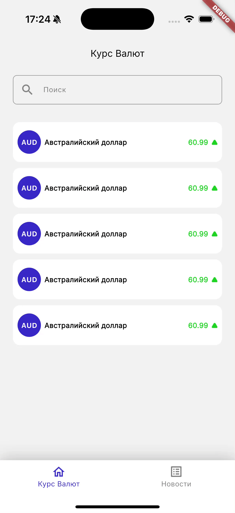
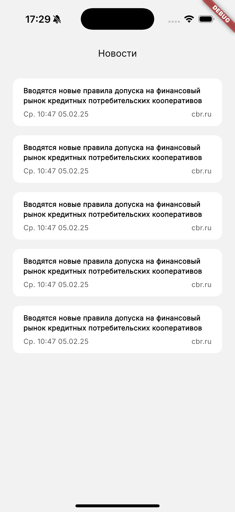
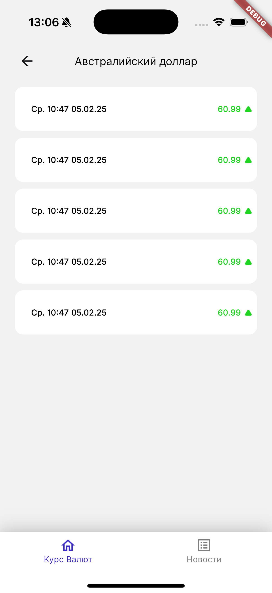
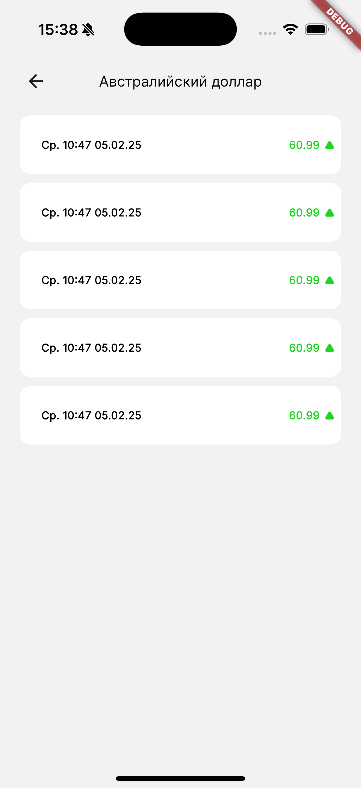

# Лабораторная работа №2. Верстка экранов и управление состоянием

## 1. Цель работы

Целью настоящей лабораторной работы является продолжение разработки мобильного приложения для отображения курсов валют. В рамках задания необходимо:

- разработать интерфейсы оставшихся экранов: детального экрана валюты, экрана списка новостей и детального экрана новости;
- освоить принципы управления состоянием пользовательского интерфейса в зависимости от действий пользователя.

Переходы между экранами будут реализованы в последующих лабораторных работах. В рамках текущего этапа допускается использование временных решений для переключения экранов.

## 2. Управление состоянием

В среде разработки Flutter состояние представляет собой набор данных, от которого зависит текущее отображение пользовательского интерфейса. При изменении состояния необходимо обеспечить соответствующее обновление компонентов UI.

На данном этапе изучается локальное управление состоянием, т.е. такое, которое осуществляется в рамках одного экрана или виджета. Использование глобальных хранилищ или сторонних библиотек не требуется.

Flutter предоставляет разработчику несколько базовых инструментов для реализации управления состоянием. В рамках лабораторной работы предполагается практическое знакомство со следующими средствами:

### StatefulWidget

`StatefulWidget` — это класс, позволяющий отдельно хранить состояние виджета и изменять его с помощью метода `setState`. Является низкоуровневым инструментом и служит основой для ручного управления состоянием в простых случаях.

### ValueListenable и ValueListenableBuilder

`ValueListenable<T>` представляет собой интерфейс, описывающий объект, уведомляющий своих слушателей при изменении значения. Наиболее распространённая реализация — `ValueNotifier<T>`, содержащий поле `value`.

`ValueListenableBuilder` — это специализированный виджет, автоматически перестраивающийся при каждом изменении отслеживаемого значения.

### ChangeNotifier и ChangeNotifierProvider

`ChangeNotifier` реализует поведенческий шаблон «наблюдатель» (Observer), уведомляя подписчиков при изменении своего состояния. Разработчик создает собственный класс, например `FooState`, расширяющий `ChangeNotifier`, и вызывает метод `notifyListeners()` при необходимости обновления интерфейса.

`ChangeNotifierProvider` используется для внедрения экземпляра класса, реализующего `ChangeNotifier`, в дерево виджетов.

> **Примечание:** для работы с `ChangeNotifierProvider` необходимо подключение пакета `provider`.

В более сложных сценариях рекомендуется использовать архитектурные подходы, такие как `BLoC` (Business Logic Component) или `Cubit`, которые предоставляют более структурированный способ управления состоянием. Подробнее о них можно узнать в пособии (Раздел 3.3.1.) или в [официальной документации Flutter](https://docs.flutter.dev/data-and-backend/state-mgmt/options#bloc-rx).

## 3. Верстка экранов

В рамках данного раздела необходимо реализовать экран "Новости", а также добавить возможность переключения между ними с помощью нижней навигационной панели:



### Экран списка новостей

На данном этапе необходимо реализовать интерфейс для отображения списка новостей. Для этого создадим соответствующую структуру файлов и папок:

- В каталоге `app` создайте папку `news_list`
- Внутри неё создайте файл `news_list_page.dart` — основной файл экрана
- Также создайте подпапку `widgets` для вспомогательных компонентов, и в ней файл `news_card.dart`

#### Компонент карточки новости (`news_card.dart`)

Карточка новости представляет собой визуальный блок, содержащий заголовок новости, дату и источник. Это позволит пользователю быстро ознакомиться с основными сведениями.

Пример реализации карточки:

```dart
import 'package:flutter/material.dart';

class NewsCard extends StatelessWidget {
  const NewsCard({super.key});

  @override
  Widget build(BuildContext context) {
    return Container(
      padding: const EdgeInsets.symmetric(vertical: 12, horizontal: 18),
      decoration: BoxDecoration(
        color: Colors.white,
        borderRadius: BorderRadius.circular(12),
      ),
      child: Column(
        children: [
          Text(
            'Вводятся новые правила допуска на финансовый рынок кредитных потребительских кооперативов',
            style: TextStyle(
              fontFamily: 'Inter',
              fontSize: 12,
              fontWeight: FontWeight.w700,
              color: Colors.black,
            ),
          ),
          Padding(
            padding: const EdgeInsets.only(top: 6),
            child: Row(
              mainAxisAlignment: MainAxisAlignment.spaceBetween,
              children: [
                Text(
                  'Ср. 10:47 05.02.25',
                  style: TextStyle(
                    fontFamily: 'Inter',
                    fontSize: 12,
                    fontWeight: FontWeight.w400,
                    color: Color(0xFF505050),
                  ),
                ),
                Text(
                  'cbr.ru',
                  style: TextStyle(
                    fontFamily: 'Inter',
                    fontSize: 12,
                    fontWeight: FontWeight.w400,
                    color: Color(0xFF505050),
                  ),
                ),
              ],
            ),
          )
        ],
      ),
    );
  }
}
```

Теперь создадим сам экран, который будет содержать список карточек. В `news_list_page.dart` добавим код:

```dart
import 'package:flutter/material.dart';
import 'package:mad_flutter_practicum/app/news_list/widgets/news_card.dart';

class NewsListPage extends StatelessWidget {
  const NewsListPage({super.key});

  @override
  Widget build(BuildContext context) {
    return Scaffold(
      appBar: AppBar(
        title: Text('Новости'),
      ),
      body: Padding(
        padding: const EdgeInsets.fromLTRB(22, 16, 22, 40),
        child: Column(
          children: [
            for (int i = 0; i < 5; i++)
              Padding(
                padding: i == 0 ? EdgeInsets.zero : const EdgeInsets.only(top: 16),
                child: NewsCard(),
              ),
          ],
        ),
      ),
    );
  }
}
```

В результате должно получиться следующее:



### Главная страница

На текущем этапе у нас уже есть два экрана: список валют и список новостей. Однако они пока не связаны между собой, и пользователь не может переключаться между ними. Для реализации этой функциональности мы воспользуемся элементом интерфейса `BottomNavigationBar`, который размещается в нижней части экрана и позволяет выбирать вкладки.

#### Создание главной страницы (`home.dart`)

- Перейдите в каталог `app`.
- Создайте файл `home.dart`, в котором будет реализована главная страница приложения с навигацией между вкладками.

```dart
import 'package:flutter/material.dart';
import 'package:mad_flutter_practicum/app/currency_tab_container/currency_tab_container.dart';

import 'news_list/news_list_page.dart';

class HomePage extends StatefulWidget {
  const HomePage({super.key});

  @override
  State<HomePage> createState() => _HomePageState();
}

class _HomePageState extends State<HomePage> {
  int _selectedIndex = 0;

  static const List<Widget> _pages = <Widget>[
    CurrencyTabContainer(),
    NewsListPage(),
  ];

  void _onItemTapped(int index) {
    setState(() {
      _selectedIndex = index;
    });
  }

  @override
  Widget build(BuildContext context) {
    final Widget currentPage = _pages[_selectedIndex];

    return Scaffold(
      body: currentPage,
      bottomNavigationBar: Container(
        decoration: BoxDecoration(
          boxShadow: <BoxShadow>[
            BoxShadow(
              color: Colors.black26,
              blurRadius: 25,
              offset: Offset(0.0, 0.75),
            ),
          ],
        ),
        child: BottomNavigationBar(
          currentIndex: _selectedIndex,
          onTap: _onItemTapped,
          items: [
            BottomNavigationBarItem(
              icon: TabWidget(
                assetPath: 'assets/icons/home.png',
                isSelected: currentPage is CurrencyTabContainer,
              ),
              label: 'Курс Валют',
            ),
            BottomNavigationBarItem(
              icon: TabWidget(
                assetPath: 'assets/icons/news.png',
                isSelected: currentPage is NewsListPage,
              ),
              label: 'Новости',
            ),
          ],
        ),
      ),
    );
  }
}

class TabWidget extends StatelessWidget {
  const TabWidget({
    super.key,
    required this.assetPath,
    required this.isSelected,
  });

  final String assetPath;
  final bool isSelected;

  @override
  Widget build(BuildContext context) {
    final BottomNavigationBarThemeData bottomBarTheme = Theme.of(context).bottomNavigationBarTheme;

    return SizedBox.square(
      dimension: 24,
      child: Image.asset(
        assetPath,
        color: isSelected ? bottomBarTheme.selectedItemColor : bottomBarTheme.unselectedItemColor,
      ),
    );
  }
}
```

#### Подключение главной страницы в `main.dart`

Теперь необходимо обновить точку входа в приложение. Для этого отредактируйте файл `main.dart` следующим образом:

```dart
import 'package:flutter/material.dart';
import 'package:mad_flutter_practicum/app/home.dart';

void main() {
  runApp(const App());
}

class App extends StatelessWidget {
  const App({super.key});

  @override
  Widget build(BuildContext context) {
    const primaryColor = Color(0xFF3929C7);
    const backgroundColor = Color(0xFFf2f2f2);
    const secondaryColor = Color(0xFF7F7F7F);

    return MaterialApp(
      theme: ThemeData(
        primaryColor: primaryColor,
        scaffoldBackgroundColor: backgroundColor,
        appBarTheme: AppBarTheme(
          backgroundColor: backgroundColor,
          titleTextStyle: TextStyle(
            fontFamily: 'Inter',
            fontSize: 16,
            color: Colors.black,
          ),
          centerTitle: true,
        ),
        bottomNavigationBarTheme: BottomNavigationBarThemeData(
          backgroundColor: Colors.white,
          selectedItemColor: primaryColor,
          unselectedItemColor: secondaryColor,
          selectedLabelStyle: TextStyle(
            fontFamily: 'Inter',
            fontSize: 12,
            color: primaryColor,
          ),
          unselectedLabelStyle: TextStyle(
            fontFamily: 'Inter',
            fontSize: 12,
            color: secondaryColor,
          ),
        ),
      ),
      home: HomePage(),
    );
  }
}
```

### Детальный экран валюты

Следующим шагом реализуем экран, на котором пользователь сможет просматривать историю изменения курса конкретной валюты:



Для этого создадим:

- В каталоге `app` папку `currency_detail`.
- Внутри неё подпапку `widgets` — для вспомогательных компонентов.
- Файл `currency_detail_page.dart` — основной файл экрана.
- Файл `currency_info_card.dart` в папке `widgets` — для отображения элемента истории курса.

#### Компонент карточки информации о курсе (`currency_info_card.dart`)

Данный компонент будет отображать дату, значение курса и иконку изменения курса (например, стрелку вверх или вниз).

```dart
import 'package:flutter/material.dart';

class CurrencyInfoCard extends StatelessWidget {
  const CurrencyInfoCard({super.key});

  @override
  Widget build(BuildContext context) {
    return Container(
      padding: const EdgeInsets.fromLTRB(18, 24, 8, 24),
      decoration: BoxDecoration(
        color: Colors.white,
        borderRadius: BorderRadius.circular(12),
      ),
      child: Row(
        children: [
          Expanded(
            child: Padding(
              padding: const EdgeInsets.symmetric(horizontal: 6),
              child: Text(
                'Ср. 10:47 05.02.25',
                style: TextStyle(
                  fontFamily: 'Inter',
                  fontSize: 12,
                  fontWeight: FontWeight.w700,
                  color: Colors.black,
                ),
              ),
            ),
          ),
          Padding(
            padding: const EdgeInsets.only(right: 6),
            child: Text(
              '60.99',
              style: TextStyle(
                fontFamily: 'Inter',
                fontSize: 12,
                fontWeight: FontWeight.w700,
                color: const Color(0xFF1FD522),
              ),
            ),
          ),
          Image.asset(
            'assets/icons/arrow_up.png',
            width: 10,
            height: 10,
          ),
        ],
      ),
    );
  }
}
```

Теперь создадим основной экран и выведем список карточек истории курса валюты. Для этого добавим код в `currency_detail_page.dart`:

```dart
import 'package:flutter/material.dart';
import 'package:mad_flutter_practicum/app/currency_detail/widgets/currency_info_card.dart';

class CurrencyDetailPage extends StatelessWidget {
  const CurrencyDetailPage({super.key, required this.title});

  final String title;

  static const double _defaultLeadingWidth = 56;
  static const double _titleSpacing = 24;

  @override
  Widget build(BuildContext context) {
    return Scaffold(
      appBar: AppBar(
        leadingWidth: _defaultLeadingWidth + _titleSpacing,
        titleSpacing: _titleSpacing,
        leading: IconButton(
          onPressed: () {
            // TODO: закрыть экран
          },
          icon: Icon(Icons.arrow_back),
        ),
        title: Text(title),
      ),
      body: Padding(
        padding: const EdgeInsets.fromLTRB(22, 10, 22, 40),
        child: Column(
          children: [
            for (int i = 0; i < 5; i++)
              Padding(
                padding: i == 0 ? EdgeInsets.zero : const EdgeInsets.only(top: 10),
                child: CurrencyInfoCard(),
              ),
          ],
        ),
      ),
    );
  }
}
```

На данный момент кнопка "Назад" не реализована. Мы добавим ее функциональность позже, когда будем работать с навигацией и управлением стеком экранов. Чтобы не забыть, оставим TODO-метку.

## 4. Навигация внутри вкладки и управление стеком экранов

На текущем этапе в приложении реализовано два экрана: список валют и детальный экран конкретной валюты. Однако пользователь пока не может попасть на детальный экран, нажав на карточку валюты. В этом разделе мы организуем навигацию внутри вкладки «Курс Валют» и реализуем стековую логику — отображение новых экранов поверх предыдущих с возможностью возврата назад.

Для этого:

- будем использовать механизм `ChangeNotifier` и `Provider`;
- создадим хранилище состояния для управления стеком экранов;
- внедрим обработку нажатий на карточку валюты;
- добавим кнопку "Назад" на детальный экран.

### Подключение зависимостей

Для начала подключим необходимые зависимости. Откройте файл `pubspec.yaml` и добавьте пакет `provider`:

```yaml
dependencies:
  flutter:
    sdk: flutter
  
  provider: 6.1.5
```

### Создание контейнера вкладки валют

Переходим к созданию логики, управляющей отображением экранов внутри вкладки «Курс Валют».

**Шаг 1:** Создание состояния вкладки (`currency_tab_state.dart`)

Создайте директорию `currency_tab_container` в папке `app`, а внутри — файл `currency_tab_state.dart`:

```dart
import 'package:flutter/material.dart';

class CurrencyTabState extends ChangeNotifier {
  CurrencyTabState(this._pages);

  late final List<Widget> _pages;

  List<Widget> get pages => List<Widget>.unmodifiable(_pages);

  void addPage(Widget page) {
    _pages.add(page);
    notifyListeners();
  }

  void removePage() {
    _pages.removeLast();
    notifyListeners();
  }
}
```

> **Важно:** без вызова `notifyListeners()` интерфейс не будет обновлён.


**Шаг 2:** Виджет-контейнер (`currency_tab_container.dart`)

Создайте файл `currency_tab_container.dart` в той же директории:

```dart
import 'package:flutter/material.dart';
import 'package:mad_flutter_practicum/app/currency_tab_container/currency_tab_state.dart';
import 'package:provider/provider.dart';
import 'package:mad_flutter_practicum/app/currency_list/currency_list_page.dart';

class CurrencyTabContainer extends StatelessWidget {
  const CurrencyTabContainer({super.key});

  @override
  Widget build(BuildContext context) {
    return ChangeNotifierProvider(
      create: (BuildContext context) => CurrencyTabState([CurrencyListPage()]),
      child: Consumer<CurrencyTabState>(
        builder: (_, CurrencyTabState state, __) {
          return state.pages.last;
        },
      ),
    );
  }
}
```

В нем мы инициализируем `CurrencyTabState`, который "поместили" в дерево виджетов Flutter. Доступ к нему можно получить через объект `BuildContext` как будет видно ниже.

Также определили `Consumer` - слушатель объекта `ChangeNotifier`. Он содержит callback `builder`, который вызывается каждый раз, когда изменяется `CurrencyTabState`. 

### Обновление главного экрана (`home.dart`)

Теперь обновим файл `home.dart`, чтобы использовать контейнер вкладки вместо обычного списка валют.

#### Замените поле `_pages`:

```dart
static const List<Widget> _pages = <Widget>[
  CurrencyTabContainer(),
  NewsListPage(),
];
```

#### Обновите условие выбора иконки:

Замените проверку `page is CurrencyListPage` на `page is CurrencyTabContainer`.

### Обработка нажатий на карточку валюты

Теперь добавим обработку нажатия на карточку валюты. Откройте файл `currency_card.dart` и добавьте следующий обработчик:

```dart
@override
Widget build(BuildContext context) {
  return GestureDetector(
    onTap: () {
      context.read<CurrencyTabState>().addPage(CurrencyDetailPage(title: 'Австралийский доллар'));
    },
    child: Container(...),
  );
}
```

### Обработка нажатия кнопки «Назад» на детальном экране валюты

Чтобы пользователь мог вернуться с детального экрана обратно, заменим `TODO` в обработчике `onPressed` на следующий код:

```dart
context.read<CurrencyTabState>().removePage()
```

## 5. Открытие новости во внешнем браузере

На экране новостей каждая карточка содержит ссылку на источник. Будет удобно, если пользователь сможет нажать на карточку и открыть соответствующую новость во внешнем браузере.

### Добавление утилиты для открытия ссылок

Для реализации такой функциональности используется пакет [url_launcher](https://pub.dev/packages/url_launcher), позволяющий запускать внешние приложения (например, браузер) с заданным URL.

Откройте файл `pubspec.yaml` и добавьте зависимость:

```yaml
dependencies:
  ...

  url_launcher: 6.3.1
```

Затем нам нужно где-то разместить нашу утилиту. Для этого перейдите в каталог `app`, создайте подпапку `utils` (если она ещё не создана), и внутри неё создайте файл `url_launcher.dart`, в который нужно добавить следующий код: 

```dart
import 'package:url_launcher/url_launcher_string.dart';

Future<void> tryLaunchUrl(String url, [LaunchMode? mode]) async {
  if (await canLaunchUrlString(url)) {
    await launchUrlString(url, mode: mode ?? LaunchMode.externalApplication);
  }
}
```

### Изменение карточки новости

Откройте файл `news_card.dart` и модифицируйте метод `build` следующим образом:

```dart
import 'package:mad_flutter_practicum/app/utils/url_launcher.dart';

class NewsCard extends StatelessWidget {
  const NewsCard({super.key});

  static const String _url = 'https://flutter.dev';

  @override
  Widget build(BuildContext context) {
    return GestureDetector(
      onTap: () => tryLaunchUrl(_url),
      child: Container(...),
    );
  }
}
```

Пропробуйте запустить приложение и открыть новость. Ничего не получится, так как мы не настроили платформы. Так давайте же сделаем это.

##### Настройка для IOS:

Откройте `ios/Runner/Info.plist` и добавьте обавьте следующий блок внутрь тега `<dict>`:

```xml
<key>LSApplicationQueriesSchemes</key>
<array>
  <string>http</string>
  <string>https</string>
</array>
```

##### Настройка Android:

Откройте `android/app/src/main/AndroidManifest.xml` и добавьте внутрь `<manifest>` элемент `<queries>` (если его ещё нет) со следующим содержимым:

```xml
<queries>
  <intent>
    <action android:name="android.intent.action.VIEW" />
    <data android:scheme="http" />
  </intent>
    <intent>
    <action android:name="android.intent.action.VIEW" />
    <data android:scheme="https" />
  </intent>
</queries>
```

## 6. Самостоятельная часть

> Перед выполнением задания рекомендуется выбрать целевой уровень. Это поможет оптимизировать время и избежать необходимости переписывать архитектуру при переходе на более высокую оценку.

### Задание на оценку "3"

- Реализовать все компоненты, описанные в основной части лабораторной работы.
- Обновить `HomePage`, заменив `setState` на `ValueNotifier` для управления выбранной вкладкой.
- Устранить ошибку, при которой состояние экрана сбрасывается при повторном открытии вкладки:
  - Откройте вкладку «Курс Валют».
  - Перейдите на детальный экран валюты.
  - Переключитесь на вкладку «Новости», затем вернитесь обратно.
  - Приложение должно возвращать пользователя не к списку, а к последнему открытому детальному экрану.

### Задание на оценку "4"

Дополнительно к предыдущим требованиям:

Реализовать отображение детального экрана валюты без отображения `BottomNavigationBar` (см. рисунок ниже).



> Использовать встроенную систему навигации Flutter (`Navigator`) и менять видимость `BottomNavigationBar` нельзя!

### Задание на оценку "5"

Дополнительно к предыдущим требованиям:

- Отказаться от "ванильного" управления состоянием (`ValueNotifier`, `ChangeNotifier`) и перейти на архитектуру `Cubit` или `Bloc` из пакета `flutter_bloc`.
- Переписать логику управления состоянием и навигацией в рамках соответствующего подхода.

> 🔎 **Примечание:** переход на более высокий уровень предполагает рефакторинг структуры проекта. Планируйте архитектуру приложения заранее, если планируете выполнить задание на оценку "4" или "5".
