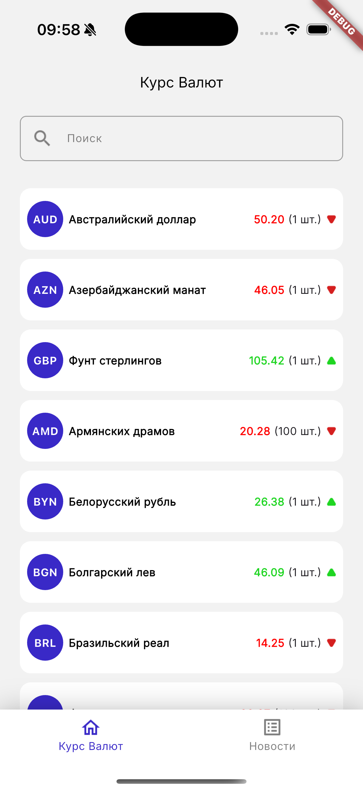
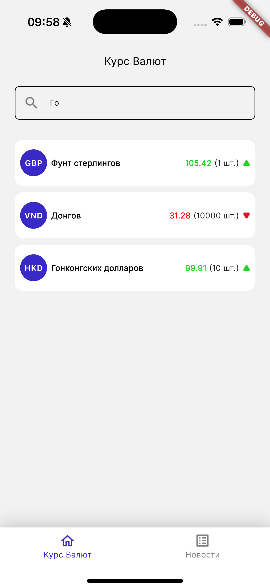
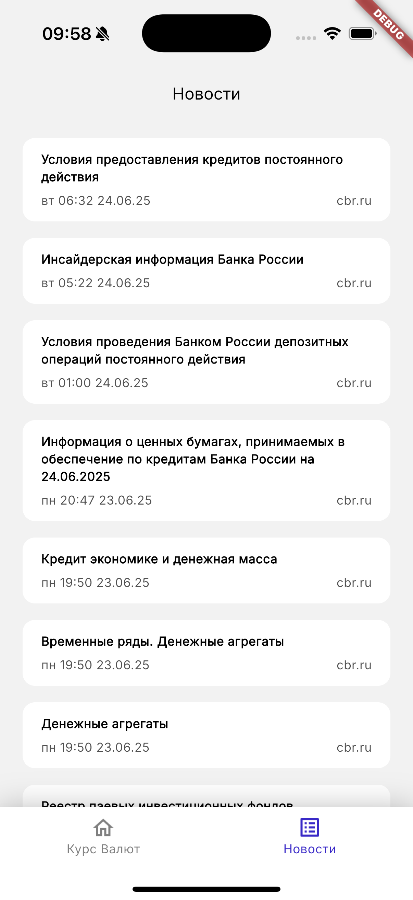
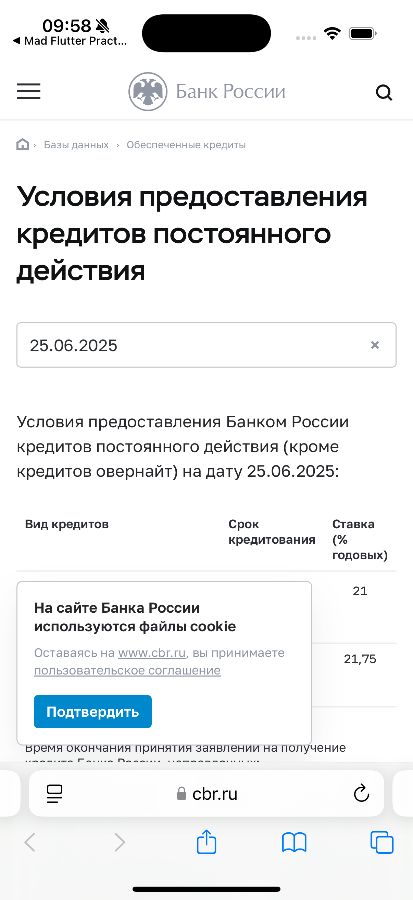

# Лабораторная работа №4. Работа с сетью

## 1. Цель работы

Целью настоящей лабораторной работы является освоение механизмов взаимодействия мобильного приложения с внешними веб-сервисами, а также внедрение многоуровневой архитектуры для работы с сетевыми данными. В ходе выполнения работы студенты:

- изучат основы выполнения HTTP-запросов с использованием пакета `http` или других популярных сетевых библиотек;
- реализуют доступ к удалённому API и обработку получаемых JSON-данных;
- заменят ранее использовавшиеся моковые данные (см. глоссарий) на реальные данные, загружаемые из сети;
- получат практические навыки обработки ошибок, состояний загрузки и успешного завершения запроса;
- реализуют отображение данных в UI на основе текущего состояния: loading, success, error (опционально).

В рамках предыдущих лабораторных работ мы использовали моки, чтобы отображать тестовые списки валют и новостей. Теперь, когда `Data` и `Domain` слои полностью реализованы, моки больше не нужны — их место займут реальные данные из репозиториев.

> 🔁 Лабораторная работа ориентирована на интеграцию ранее созданных экранов с реальными сетевыми данными. Архитектура приложения должна быть модифицирована с учётом принципов чистой архитектуры и устойчивости к ошибкам сетевого взаимодействия.

## 2. Общее описание

В рамках данной лабораторной работы обучающимся предстоит внедрить в приложение полноценную работу с удалёнными источниками данных, используя архитектуру, основанную на разделении слоёв `data`, `domain` и `app`.

Ранее в приложении использовались моковые данные, встроенные непосредственно в слой `app`. В рамках текущей лабораторной работы данные были вынесены в отдельные слои и заменены на реальные данные, получаемые из сети:

- Слой `domain` содержит декларации моделей (`CurrencyModel`, `NewsModel`) и абстракции в виде интерфейсов источников данных и репозиториев.
- Слой `data` реализует указанные абстракции: включает реализацию REST-клиента, описание путей, DTO-модели для парсинга  JSON и RSS, мапперы и соответствующие им классы-имплементации репозиториев и источников данных.

> Для получения пояснений по используемым терминам, таким как REST-клиент, DTO-модели, RSS и мапперы, рекомендуется обратиться к файлу **Глоссария**

### Архитектура

- `domain/datasource/` — содержит интерфейс `RestDatasource`, описывающий абстрактные методы получения данных;
- `domain/repository/` — содержит абстрактные интерфейсы репозиториев (`CurrencyRepository`, `NewsRepository`);
- `domain/model/` — содержит чистые доменные модели;

- `data/datasource_impl/rest_datasource_impl/` — реализация REST-доступа, включая:
  - `app_http_client.dart` — обёртка над `http.Client`;
  - `rest_path.dart` — описание путей к удалённым REST ресурсам;
  - `rest_datasource_impl.dart` — реализация интерфейса `RestDatasource`;
  - `model/` — модели данных, соответствующие JSON-ответам;
  - `mapper/` — функции трансформации сетевых моделей в доменные;

- `data/repository_impl/` — реализация репозиториев `CurrencyRepositoryImpl`, `NewsRepositoryImpl`, использующих `RestDatasourceImpl` в качестве источника данных;

## 3. Основная часть

### Объявление зависимостей

Для реализации сетевого взаимодействия и автоматической генерации кода необходимо подключить следующие зависимости в файл `pubspec.yaml`:

```yaml
dependencies:
  http: 1.4.0
  rss_dart: 1.0.13
  json_annotation: 4.9.0

  intl: 0.20.2

dev_dependencies:
  build_runner: 2.4.15
  json_serializable: 6.9.5
```

Библиотека `http` используется для выполнения HTTP-запросов, `rss_dart` — для парсинга RSS-лент, `json_annotation` и `json_serializable` — для сериализации и десериализации JSON, а `intl` — для форматирования дат и чисел. `build_runner` необходим для генерации вспомогательного кода.

### Реализация слоя `domain`

Слой `domain` описывает бизнес-логику приложения и не зависит от конкретной реализации источников данных. В данном разделе необходимо определить модели предметной области, интерфейсы репозиториев и источников данных.

#### Модели

Определим базовые модели, отражающие сущности приложения: валюту и новостной элемент. Эти модели используются во всех слоях, не содержат методов реализации и не зависят от форматов хранения или передачи данных.

Создайте файлы:

- `lib/domain/model/currency_model.dart`

```dart
class CurrencyModel {
  const CurrencyModel({
    required this.id,
    required this.nominal,
    required this.name,
    required this.symbol,
    required this.value,
    required this.previousValue,
  });

  final String id;
  final int nominal;
  final String name;
  final String symbol;
  final double value;
  final double previousValue;
}
```

- `lib/domain/model/news_model.dart`

```dart
class NewsModel {
  const NewsModel({
    required this.title,
    required this.link,
    this.date,
  });

  final String title;
  final String link;
  final DateTime? date;
}
```

#### Интерфейсы источников данных

Определите абстракции источников данных, которые будут реализованы в `data` слое. Это позволит разделить бизнес-логику и детали получения данных, обеспечивая гибкость и тестируемость приложения.

Создайте файл:

- `lib/domain/datasource/rest_datasource.dart`

```dart
import 'package:mad_flutter_practicum/domain/model/currency_model.dart';
import 'package:mad_flutter_practicum/domain/model/news_model.dart';

abstract interface class RestDatasource {
  Future<List<CurrencyModel>> getCurrencyList();

  Future<List<NewsModel>> getNewsList();
}
```

#### Интерфейсы репозиториев

Репозитории инкапсулируют логику получения данных из различных источников и предоставляют унифицированный интерфейс для слоя бизнес-логики. Интерфейсы репозиториев объявляются в `domain` слое и реализуются в `data`.

Создайте файлы:

- `lib/domain/repository/currency_repository.dart`

```dart
import 'package:mad_flutter_practicum/domain/model/currency_model.dart';

abstract interface class CurrencyRepository {
  Future<List<CurrencyModel>> getCurrencyList();
}
```

- `lib/domain/repository/news_repository.dart`

```dart
import 'package:mad_flutter_practicum/domain/model/news_model.dart';

abstract interface class NewsRepository {
  Future<List<NewsModel>> getNewsList();
}
```

### Реализация слоя `data`

Слой `data` содержит реализацию источников данных и репозиториев, соответствующих интерфейсам из слоя `domain`. Здесь происходит взаимодействие с внешними API, парсинг данных и преобразование DTO-моделей в доменные модели.

#### HTTP-клиент

Создадим файл `lib/data/datasource_impl/rest_datasource_impl/app_http_client.dart`, в котором определим клиент для выполнения HTTP-запросов. Этот клиент будет обёрткой над пакетом `http` и обеспечит единый способ обработки запросов и ответов, включая базовые настройки (например, таймауты, заголовки).

```dart
import 'dart:convert';

import 'package:http/http.dart' as http;

class AppHttpClient {
  final http.Client _client = http.Client();

  Future<String?> getDecodedResponse(String url) async {
    final http.Response response = await _client.get(Uri.parse(url));

    return response.statusCode == 200 ? utf8.decode(response.bodyBytes) : null;
  }

  void dispose() => _client.close();
}
```

#### Пути и константы API

Создадим файлы `rest_path.dart` (для хранения путей к REST-эндполитам) и `constants.dart` (для базовых URL и других повторяющихся значений) в директории `lib/data/datasource_impl/rest_datasource_impl/`.

```dart
abstract class RestPath {
  static const String dailyExchangeRateUrl = 'https://www.cbr-xml-daily.ru/daily_json.js';
  static const String newsUrl = 'http://www.cbr.ru/rss/RssNews';
}
```

```dart
abstract class RestConstants {
  static const String newsDateTimeFormat = 'EEE, dd MMM yyyy HH:mm:ss Z';
}
```

#### DTO-модели

Создадим DTO-классы (Data Transfer Objects) для десериализации JSON-ответов от API. Разместим их в папке `lib/data/datasource_impl/rest_datasource_impl/model`.

Создайте `currency_dto.dart` — основной класс с аннотациями для JSON-сериализации:

```dart
import 'package:json_annotation/json_annotation.dart';
import 'package:mad_flutter_practicum/domain/model/currency_model.dart';

part 'currency_dto.g.dart';

@JsonSerializable(createToJson: false)
class CurrencyDto {
  const CurrencyDto({
    required this.id,
    required this.nominal,
    required this.name,
    required this.symbol,
    required this.value,
    required this.previousValue,
  });

  factory CurrencyDto.fromJson(Map<String, dynamic> json) => _$CurrencyDtoFromJson(json);

  @JsonKey(name: 'ID', defaultValue: '')
  final String id;

  @JsonKey(name: 'Nominal', defaultValue: 0)
  final int nominal;

  @JsonKey(name: 'Name', defaultValue: '')
  final String name;

  @JsonKey(name: 'CharCode', defaultValue: '')
  final String symbol;

  @JsonKey(name: 'Value', defaultValue: 0)
  final double value;

  @JsonKey(name: 'Previous', defaultValue: 0)
  final double previousValue;
}

@JsonSerializable(createToJson: false)
class CurrencyListResponseDto {
  const CurrencyListResponseDto({required this.valute});

  factory CurrencyListResponseDto.fromJson(Map<String, dynamic> json) => _$CurrencyListResponseDtoFromJson(json);

  @JsonKey(name: 'Valute', defaultValue: <String, CurrencyDto>{})
  final Map<String, CurrencyDto> valute;
}
```

В начале файла `currency_dto.dart` указывается директива:

```dart
part 'currency_dto.g.dart';
```

Файл `currency_dto.g.dart` создаётся автоматически при генерации кода на основе аннотаций `@JsonSerializable()` в DTO-классах. Он содержит вспомогательные методы сериализации и десериализации (`fromJson()` и `toJson()`), используемые для преобразования объектов в формат JSON и обратно.

Для создания или обновления этого файла после изменений в DTO-моделях необходимо выполнить команду генерации:

```bash
flutter pub run build_runner build
```

Без этого шага код не скомпилируется, так как отсутствуют необходимые части, обеспечивающие преобразование данных.

#### Мапперы

В директории `lib/data/datasource_impl/rest_datasource_impl/mapper` создадим файлы `news_mapper.dart` и `currency_mapper.dart`, который будет содержать метод для преобразования DTO-модели в доменную модель. Это позволяет разделить слои и избежать зависимости домена от внешних форматов.

```dart
import 'package:intl/intl.dart';
import 'package:mad_flutter_practicum/data/datasource_impl/rest_datasource_impl/constants.dart';
import 'package:mad_flutter_practicum/domain/model/news_model.dart';
import 'package:rss_dart/domain/rss_item.dart';

extension NewsItemMapper on RssItem {
  NewsModel get asNewsModel {
    final String? pubDate = this.pubDate;

    return NewsModel(
      title: title ?? '',
      link: link ?? '',
      date: pubDate == null ? null : DateFormat(RestConstants.newsDateTimeFormat).parse(pubDate),
    );
  }
}
```

```dart
import 'package:mad_flutter_practicum/data/datasource_impl/rest_datasource_impl/model/currency_dto.dart';
import 'package:mad_flutter_practicum/domain/model/currency_model.dart';

extension CurrencyDtoMapper on CurrencyDto {
  CurrencyModel get model => CurrencyModel(
        id: id,
        nominal: nominal,
        name: name,
        symbol: symbol,
        value: value,
        previousValue: previousValue,
      );
}
```

#### Реализация источников данных

В директории `lib/data/datasource_impl/rest_datasource_impl` создадим одноименный файл, где реализуем интерфейс `RestDatasource`, определённый в domain. Здесь будут использоваться HTTP-клиент и DTO-модели для загрузки и предварительной обработки данных.

```dart
import 'dart:convert';

import 'package:mad_flutter_practicum/data/datasource_impl/rest_datasource_impl/app_http_client.dart';
import 'package:mad_flutter_practicum/data/datasource_impl/rest_datasource_impl/mapper/currency_mapper.dart';
import 'package:mad_flutter_practicum/data/datasource_impl/rest_datasource_impl/mapper/news_mapper.dart';
import 'package:mad_flutter_practicum/data/datasource_impl/rest_datasource_impl/model/currency_dto.dart';
import 'package:mad_flutter_practicum/data/datasource_impl/rest_datasource_impl/rest_path.dart';
import 'package:mad_flutter_practicum/domain/datasource/rest_datasource.dart';
import 'package:mad_flutter_practicum/domain/model/currency_model.dart';
import 'package:mad_flutter_practicum/domain/model/news_model.dart';
import 'package:rss_dart/dart_rss.dart';

class RestDatasourceImpl implements RestDatasource {
  late final AppHttpClient _httpClient = AppHttpClient();

  @override
  Future<List<CurrencyModel>> getCurrencyList() async {
    final String? response = await _httpClient.getDecodedResponse(RestPath.dailyExchangeRateUrl);
    if (response == null) return const <CurrencyModel>[];

    final Map<String, dynamic> json = jsonDecode(response);

    return CurrencyListResponseDto.fromJson(json).valute.values.map((e) => e.model).toList(growable: false);
  }

  @override
  Future<List<NewsModel>> getNewsList() async {
    final String? response = await _httpClient.getDecodedResponse(RestPath.newsUrl);
    if (response == null) return const <NewsModel>[];

    return RssFeed.parse(response).items.map((e) => e.asNewsModel).toList(growable: false);
  }
}
```

#### Реализация репозиториив

В директории `lib/data/repository_impl` создадим файлы `currency_repository_impl.dart` и `news_repository_impl.dart`. В этих файлах реализуем интерфейсы репозиториев, подключив реализацию источников данных.

```dart
import 'package:mad_flutter_practicum/domain/datasource/rest_datasource.dart';
import 'package:mad_flutter_practicum/domain/model/currency_model.dart';
import 'package:mad_flutter_practicum/domain/repository/currency_repository.dart';

class CurrencyRepositoryImpl implements CurrencyRepository {
  const CurrencyRepositoryImpl(this._rest);

  final RestDatasource _rest;

  @override
  Future<List<CurrencyModel>> getCurrencyList() => _rest.getCurrencyList();
}
```

```dart
import 'package:mad_flutter_practicum/domain/datasource/rest_datasource.dart';
import 'package:mad_flutter_practicum/domain/model/news_model.dart';
import 'package:mad_flutter_practicum/domain/repository/news_repository.dart';

class NewsRepositoryImpl implements NewsRepository {
  const NewsRepositoryImpl(this._rest);

  final RestDatasource _rest;

  @override
  Future<List<NewsModel>> getNewsList() => _rest.getNewsList();
}
```

### Реализация слоя `app`

Слой `app` представляет собой точку входа в приложение и отвечает за настройку глобальных зависимостей, навигацию и отображение пользовательского интерфейса. На этом этапе мы удалим моки и подключим реальные данные из слоёв `data` и `domain`.

#### Константы приложения

Создадим файл `constants.dart` в корне слоя `app`. В нём определим статические значения, такие как формат даты и локаль, которые будут использоваться во всём проекте для форматирования:

```dart
abstract class AppConstants {
  static const String newsDateTimeFormat = 'E HH:mm dd.MM.yy';

  static const String ruLocale = 'ru_RU';
}
```

#### Настройка зависимостей и инициализация приложения

Обновим файл `main.dart.` В этом файле инициализируем локаль для форматирования дат, создадим провайдеры для репозиториев и передадим их через `MultiProvider` в корень приложения:

```dart
import 'package:flutter/material.dart';
import 'package:intl/date_symbol_data_local.dart';
import 'package:mad_flutter_practicum/app/constants.dart';
import 'package:mad_flutter_practicum/app/home.dart';
import 'package:mad_flutter_practicum/app/splash_page.dart';
import 'package:mad_flutter_practicum/data/datasource_impl/rest_datasource_impl/rest_datasource_impl.dart';
import 'package:mad_flutter_practicum/data/repository_impl/currency_repository_impl.dart';
import 'package:mad_flutter_practicum/data/repository_impl/news_repository_impl.dart';
import 'package:mad_flutter_practicum/domain/datasource/rest_datasource.dart';
import 'package:mad_flutter_practicum/domain/repository/currency_repository.dart';
import 'package:mad_flutter_practicum/domain/repository/news_repository.dart';
import 'package:provider/provider.dart';

Future<void> main() async {
  await initializeDateFormatting(AppConstants.ruLocale, null);

  final restDatasource = RestDatasourceImpl();

  runApp(
    GlobalProviders(
      restDatasource: restDatasource,
      child: const App(),
    ),
  );
}

class GlobalProviders extends StatelessWidget {
  const GlobalProviders({super.key, required this.restDatasource, required this.child});

  final RestDatasource restDatasource;
  final Widget child;

  @override
  Widget build(BuildContext context) {
    return MultiProvider(
      providers: [
        Provider<CurrencyRepository>(create: (_) => CurrencyRepositoryImpl(restDatasource)),
        Provider<NewsRepository>(create: (_) => NewsRepositoryImpl(restDatasource)),
      ],
      child: child,
    );
  }
}
```

#### Обновление экрана и карточек валют

Карточки валют больше не используют моковые данные — вместо этого мы передаём им экземпляры `CurrencyModel`, полученные из репозитория:

```dart
import 'package:flutter/material.dart';
import 'package:mad_flutter_practicum/app/currency_detail/currency_detail_page.dart';
import 'package:mad_flutter_practicum/domain/model/currency_model.dart';

enum PriceChange {
  up,
  down,
  stable;
}

class CurrencyCard extends StatelessWidget {
  const CurrencyCard({super.key, required this.model});

  final CurrencyModel model;

  @override
  Widget build(BuildContext context) {
    final PriceChange priceChange = model.asPriceChange;

    return GestureDetector(
      onTap: () {
        Navigator.push(
          context,
          MaterialPageRoute(builder: (_) => CurrencyDetailPage(title: model.name)),
        );
      },
      child: Container(
        padding: const EdgeInsets.symmetric(vertical: 14, horizontal: 8),
        decoration: BoxDecoration(
          color: Colors.white,
          borderRadius: BorderRadius.circular(12),
        ),
        child: Row(
          children: [
            CurrencyIcon(title: model.symbol),
            Expanded(
              child: Padding(
                padding: const EdgeInsets.symmetric(horizontal: 6),
                child: Text(
                  model.name,
                  style: TextStyle(
                    fontFamily: 'Inter',
                    fontSize: 12,
                    fontWeight: FontWeight.w700,
                    color: Colors.black,
                  ),
                ),
              ),
            ),
            Text(
              model.value.toStringAsFixed(2),
              style: TextStyle(
                fontFamily: 'Inter',
                fontSize: 12,
                fontWeight: FontWeight.w700,
                color: switch (priceChange) {
                  PriceChange.up => const Color(0xFF1FD522),
                  PriceChange.down => const Color(0xFFFF0000),
                  PriceChange.stable => const Color(0xFF7C7B7B),
                },
              ),
            ),
            Padding(
              padding: const EdgeInsets.only(left: 4, right: 6),
              child: Text(
                '(${model.nominal} шт.)',
                style: TextStyle(
                  fontFamily: 'Inter',
                  fontSize: 12,
                  fontWeight: FontWeight.w500,
                ),
              ),
            ),
            Image.asset(
              switch (priceChange) {
                PriceChange.up => 'assets/icons/arrow_up.png',
                PriceChange.down => 'assets/icons/arrow_down.png',
                PriceChange.stable => 'assets/icons/arrow_up.png',
              },
              width: 10,
              height: 10,
            ),
          ],
        ),
      ),
    );
  }
}

class CurrencyIcon extends StatelessWidget {
  const CurrencyIcon({super.key, required this.title});

  final String title;

  @override
  Widget build(BuildContext context) {
    return Container(
      constraints: BoxConstraints.tight(Size.square(40)),
      decoration: BoxDecoration(
        color: Theme.of(context).primaryColor,
        shape: BoxShape.circle,
      ),
      child: Center(
        child: Text(
          title,
          style: TextStyle(
            fontFamily: 'InterTight',
            fontSize: 12,
            fontWeight: FontWeight.w700,
            color: Colors.white,
          ),
        ),
      ),
    );
  }
}

extension on CurrencyModel {
  PriceChange get asPriceChange {
    if (value > previousValue) return PriceChange.up;
    if (value < previousValue) return PriceChange.down;

    return PriceChange.stable;
  }
}
```

Теперь карточки отображаются на экране списка валют, данные для которого загружаются асинхронно с помощью `FutureBuilder`. Также добавим поиск валют с помощью `SearchView`.

```dart
import 'package:flutter/material.dart';
import 'package:mad_flutter_practicum/app/currency_list/widgets/currency_card.dart';
import 'package:mad_flutter_practicum/app/currency_list/widgets/search_view.dart';
import 'package:mad_flutter_practicum/domain/model/currency_model.dart';
import 'package:mad_flutter_practicum/domain/repository/currency_repository.dart';
import 'package:provider/provider.dart';

class CurrencyListPage extends StatefulWidget {
  const CurrencyListPage({super.key});

  @override
  State<CurrencyListPage> createState() => _CurrencyListPageState();
}

class _CurrencyListPageState extends State<CurrencyListPage> {
  late final ValueNotifier<List<CurrencyModel>> _filteredCurrencies;

  late Future<List<CurrencyModel>> _currencyListFuture;

  List<CurrencyModel> _allCurrencies = [];

  @override
  void initState() {
    super.initState();
    _initData();
  }

  @override
  void dispose() {
    _filteredCurrencies.dispose();
    super.dispose();
  }

  void _initData() {
    _currencyListFuture = context.read<CurrencyRepository>().getCurrencyList().then((List<CurrencyModel> value) {
      _allCurrencies = value;
      _filteredCurrencies = ValueNotifier(value);

      return value;
    });
  }

  void _filterCurrencies(String query) {
    final String lowerQuery = query.toLowerCase();
    final Iterable<CurrencyModel> result = _allCurrencies.where((CurrencyModel currency) {
      return currency.name.toLowerCase().contains(lowerQuery) || currency.symbol.toLowerCase().contains(lowerQuery);
    });

    _filteredCurrencies.value = result.toList(growable: false);
  }

  @override
  Widget build(BuildContext context) {
    return Scaffold(
      appBar: AppBar(
        title: Text('Курс Валют'),
        surfaceTintColor: Colors.transparent,
      ),
      body: FutureBuilder(
        future: _currencyListFuture,
        builder: (BuildContext context, AsyncSnapshot<List<CurrencyModel>> snapshot) {
          final List<CurrencyModel>? data = snapshot.data;
          if (data == null) return const SizedBox.shrink();

          return Column(
            children: [
              Padding(
                padding: const EdgeInsets.symmetric(vertical: 10, horizontal: 22),
                child: SearchView(onChanged: _filterCurrencies),
              ),
              Expanded(
                child: ValueListenableBuilder<List<CurrencyModel>>(
                  valueListenable: _filteredCurrencies,
                  builder: (BuildContext context, List<CurrencyModel> data, _) {
                    return ListView.builder(
                      itemCount: data.length,
                      itemBuilder: (BuildContext context, int index) {
                        final CurrencyModel currency = data[index];

                        return Padding(
                          key: ValueKey(currency.id),
                          padding: index == 0 ? const EdgeInsets.only(top: 20) : const EdgeInsets.only(top: 10),
                          child: CurrencyCard(model: currency),
                        );
                      },
                      padding: const EdgeInsets.fromLTRB(22, 0, 22, 40),
                    );
                  }
                ),
              ),
            ],
          );
        },
      ),
    );
  }
}
```
После внесённых изменений, экран со списком валют выглядит следующим образом:



Для обработки текста поиска и обновления списка используется `ValueNotifier` (в вашем случае это должен быть state manager, определенный в предыдущих ЛР согласно выбранному варианту), что позволяет эффективно фильтровать отображаемые данные без необходимости перерисовывать весь виджет.

#### Обновление виджета поиска

Компонент `SearchView`, созданный ранее, теперь вызывает колбэк при изменении текста — это инициализирует фильтрацию списка.

```dart
class SearchView extends StatelessWidget {
  const SearchView({super.key, required this.onChanged});

  final ValueChanged<String> onChanged;

  @override
  Widget build(BuildContext context) {
    return TextField(
      onChanged: onChanged,
      ...
    );
  }
}
```

При вводе текста в поле поиска список автоматически фильтруется по названию или символу валюты:



#### Обновление новостного экрана и карточек

Аналогично экрану с валютами, подключим реальные данные новостей, полученные через репозиторий. Обновим карточку новости так, чтобы она отображала заголовок, дату публикации и источник. При нажатии на карточку должно происходить открытие соответствующей ссылки на новость. Ранее на этом месте использовались моковые данные.

```dart
import 'package:flutter/material.dart';
import 'package:intl/intl.dart';
import 'package:mad_flutter_practicum/app/constants.dart';
import 'package:mad_flutter_practicum/app/utils/url_launcher.dart';
import 'package:mad_flutter_practicum/domain/model/news_model.dart';

class NewsCard extends StatelessWidget {
  const NewsCard({super.key, required this.model});

  final NewsModel model;

  static const String _resource = 'cbr.ru';

  @override
  Widget build(BuildContext context) {
    final DateTime? date = model.date;

    return GestureDetector(
      onTap: () => tryLaunchUrl(model.link),
      child: Container(
        padding: const EdgeInsets.symmetric(vertical: 12, horizontal: 18),
        decoration: BoxDecoration(
          color: Colors.white,
          borderRadius: BorderRadius.circular(12),
        ),
        child: Column(
          crossAxisAlignment: CrossAxisAlignment.start,
          children: [
            Text(
              model.title,
              style: TextStyle(
                fontFamily: 'Inter',
                fontSize: 12,
                fontWeight: FontWeight.w700,
                color: Colors.black,
              ),
            ),
            Padding(
              padding: const EdgeInsets.only(top: 6),
              child: Row(
                mainAxisAlignment: MainAxisAlignment.spaceBetween,
                children: [
                  if (date != null)
                    Text(
                      DateFormat(AppConstants.newsDateTimeFormat, AppConstants.ruLocale).format(date),
                      style: TextStyle(
                        fontFamily: 'Inter',
                        fontSize: 12,
                        fontWeight: FontWeight.w400,
                        color: Color(0xFF505050),
                      ),
                    ),
                  Text(
                    _resource,
                    style: TextStyle(
                      fontFamily: 'Inter',
                      fontSize: 12,
                      fontWeight: FontWeight.w400,
                      color: Color(0xFF505050),
                    ),
                  ),
                ],
              ),
            )
          ],
        ),
      ),
    );
  }
}
```

Новости отображаются на отдельной странице, где данные загружаются через `FutureBuilder`. Каждая карточка создаётся с уникальным ключом на основе ссылки.

```dart
import 'package:flutter/material.dart';
import 'package:mad_flutter_practicum/app/news_list/widgets/news_card.dart';
import 'package:mad_flutter_practicum/domain/model/news_model.dart';
import 'package:mad_flutter_practicum/domain/repository/news_repository.dart';
import 'package:provider/provider.dart';

class NewsListPage extends StatefulWidget {
  const NewsListPage({super.key});

  @override
  State<NewsListPage> createState() => _NewsListPageState();
}

class _NewsListPageState extends State<NewsListPage> {
  late Future<List<NewsModel>> _newsListFuture;

  @override
  void initState() {
    super.initState();
    _newsListFuture = context.read<NewsRepository>().getNewsList();
  }

  @override
  Widget build(BuildContext context) {
    return Scaffold(
      appBar: AppBar(
        title: Text('Новости'),
        surfaceTintColor: Colors.transparent,
      ),
      body: FutureBuilder<List<NewsModel>>(
        future: _newsListFuture,
        builder: (BuildContext context, AsyncSnapshot<List<NewsModel>> snapshot) {
          final List<NewsModel>? data = snapshot.data;
          if (data == null) return const SizedBox.shrink();

          return ListView.builder(
            itemCount: data.length,
            itemBuilder: (BuildContext context, int index) {
              final NewsModel news = data[index];

              return Padding(
                key: ValueKey(news.link),
                padding: index == 0 ? EdgeInsets.zero : const EdgeInsets.only(top: 16),
                child: NewsCard(model: news),
              );
            },
            padding: const EdgeInsets.fromLTRB(22, 16, 22, 40),
          );
        },
      ),
    );
  }
}
```

Экран новостей отображает актуальные заголовки и дату публикации. Пример финального внешнего вида экрана новостей:



При клике на карточку новости происходит переход во внешний браузер на сайт источника:



## 4. Самостоятельная часть

> Перед выполнением задания рекомендуется выбрать целевой уровень. Это поможет оптимизировать время и избежать необходимости переписывать архитектуру при переходе на более высокую оценку.

### Задание на оценку "3"

- Реализовать все компоненты, описанные в основной части лабораторной работы.
- Добавьте индикатор загрузки (`CircularProgressIndicator`) для экрана новостей и валют;
- Добавьте `pull-to-refresh` на экраны списка валют и новостей с использованием `RefreshIndicator`.
- Реализуйте отображение ошибки при неудачной загрузке данных (например, при отсутствии интернета). В этом случае должен показываться виджет с сообщением об ошибке и кнопкой "Повторить попытку", при нажатии на которую происходит очередная попытка загрузки данных.

### Задание на оценку "4"

Дополнительно к предыдущим требованиям:

- Добавьте проверку подключения к интернету перед выполнением запроса и отобразите соответствующее сообщение при отсутствии подключения. Для этого можно использовать пакет `connectivity_plus`.

### Задание на оценку "5"

Дополнительно к предыдущим требованиям:

- Реализуйте загрузку динамики курса валюты за последний месяц для экрана детализации.
- Замените моковые данные на реальные, получаемые по сети.
- Используйте API Центрального Банка РФ

> Пример запроса курса доллара на месяц: https://www.cbr.ru/scripts/XML_dynamic.asp?date_req1=25/05/2025&date_req2=25/06/2025&VAL_NM_RQ=R01235

- Формат ответа — XML. Необходимо использовать парсинг XML в Dart.
- На экране следует визуализировать курс валюты по датам, например в виде списка или графика (по желанию).

Документация по API: [https://www.cbr.ru/development/sxml/](https://www.cbr.ru/development/sxml/)
