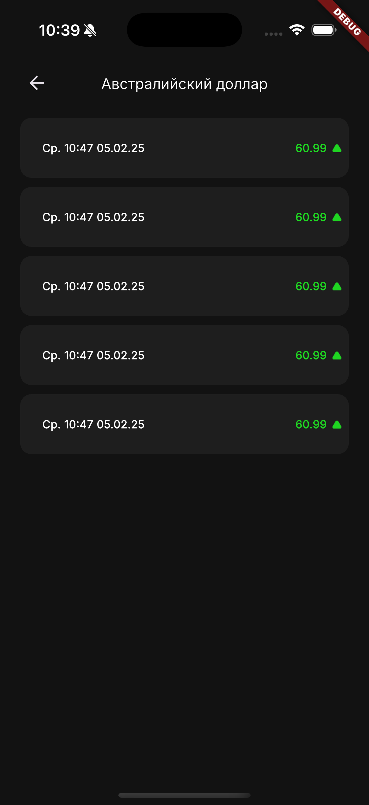

# Лабораторная работа №5. Локальное хранение данных

## 1. Цель работы

Целью настоящей лабораторной работы является приобретение студентами практических навыков работы с локальными хранилищами данных в мобильных приложениях на платформе Flutter. В процессе выполнения лабораторной работы обучающиеся:

- ознакомятся с различными типами локального хранения (ключ-значение, защищённое хранилище, реляционные базы данных);
- изучат возможности использования библиотек `shared_preferences`, `flutter_secure_storage`, (`SQFLite`/`Drift`) в контексте хранения пользовательских данных и кэширования;
- реализуют сохранение и извлечение данных (например, токенов доступа, кэшированных валют и новостей) с использованием локальных механизмов хранения;
- интегрируют локальные хранилища в существующую архитектуру проекта с соблюдением принципов модульности и тестируемости.

## 2. Общее описание

В рамках настоящей лабораторной работы в мобильное приложение на Flutter внедряется механизм локального хранения данных. Это необходимо для обеспечения устойчивой работы приложения при отсутствии интернет-соединения, а также для реализации оффлайн-доступа к ранее полученным данным.

Обучающимся предстоит использовать различные подходы к хранению данных в зависимости от их характера и требований к безопасности:

- для хранения простых пользовательских настроек и флагов — `shared_preferences`;
- для сохранения конфиденциальной информации (например, токенов доступа) — `flutter_secure_storage`;
- для хранения структурированных или объёмных данных — `SQFLite` или `Drift`.

Особое внимание уделяется архитектурной интеграции локального хранилища в проект: реализация интерфейсов источников данных (`datasource`), сохранение и извлечение данных в соответствующих слоях (`data`, `domain`), а также обеспечение кэширования результатов сетевых запросов.

Дополнительно, в рамках лабораторной работы обучающиеся создадут экран авторизации (генерация токена) и экран профиля, где реализуются:
- выбор темы приложения (светлая, тёмная, системная);
- возможность выхода из аккаунта (удаление токена и деавторизация).

> Оба параметра будут храниться локально на устройстве, пока полькозователь не очистит кеш приложения!

Результатом выполнения лабораторной работы станет модифицированное приложение, способное сохранять данные локально и восстанавливать их при повторном запуске или в оффлайн-режиме, сохраняя при этом архитектурную целостность и расширяемость проекта.

## 3. Основная часть

### Объявление зависимостей

Подключим зависимости в `pubspec.yaml`:

```yaml
  path: 1.9.1
  path_provider: 2.1.5

  sqflite: 2.4.2

  shared_preferences: 2.5.3
  flutter_secure_storage: 9.2.4
```

- `shared_preferences` — для хранения простых настроек и пользовательских флагов;
- `flutter_secure_storage` — для хранения токенов и другой конфиденциальной информации;
- `drift` или `sqflite` — для работы с локальной базой данных (если потребуется кэширование сложных структур);
- `path` и `path_provider` — для определения пути к директориям на устройстве (требуется при использовании `drift`/`sqflite`).

### Реализация слоя `domain`

#### Модели

Создадим файл `domain/model/app_theme_mode.dart` в котором определяем модель для хранения состояния темы приложения:

```dart
enum AppThemeMode { light, dark, system }
```

#### Интерфейсы источников данных

Определим новые интерфейсы локальных источников данных:

- `PreferenceDatasource` в файле `domain/datasource/preference_datasource.dart` - для хранения темы и токена;
- `DbDatasource` в файле `domain/datasource/db_datasource.dart` - для сохранения и выборки новостей и валют из локальной базы данных.

```dart
import 'package:mad_flutter_practicum/domain/model/app_theme_mode.dart';

abstract interface class PreferenceDatasource {
  abstract final AppThemeMode themeMode;

  void setThemeMode(AppThemeMode mode);

  Future<String?> getToken();

  Future<void> setToken(String? token);
}
```

```dart
import 'package:mad_flutter_practicum/domain/model/currency_model.dart';
import 'package:mad_flutter_practicum/domain/model/news_model.dart';

abstract interface class DbDatasource {
  Future<List<CurrencyModel>> getCurrencyList();

  Future<List<NewsModel>> getNewsList();

  Future<void> saveCurrencyList(List<CurrencyModel> value);

  Future<void> saveNewsList(List<NewsModel> value);
}
```

#### Интерфейсы репозиториев

Обновим классы репозиториев `CurrencyRepository` и `NewsRepository`, добавив новые методы для кеширования:

```dart
abstract interface class CurrencyRepository {
  ...

  Future<void> saveCurrencyList(List<CurrencyModel> value);
}
```

```dart
abstract interface class NewsRepository {
  ...

  Future<void> saveNewsList(List<NewsModel> value);
}
```

Кроме того создадим новый файл репозитория `domain/repository/settings_repository.dart`:

```dart
import 'package:mad_flutter_practicum/domain/model/app_theme_mode.dart';

abstract interface class SettingsRepository {
  Future<void> initAsyncData();

  abstract final Stream<bool> isAuthStream;

  abstract final bool isAuth;

  abstract final Stream<AppThemeMode> themeModeStream;

  abstract final AppThemeMode themeMode;

  void setThemeMode(AppThemeMode mode);

  Future<String?> getToken();

  Future<void> setToken(String? token);
}
```

### Реализация слоя `data`

#### Реализация источников данных

По аналогии с прошлой ЛР создадим 2 реализации источников даннных: `preference_datasource_impl` и `sqflite_datasource_impl`.

##### Preference datasource

В корневой директории `preference_datasource_impl` создадим файлы

- `/model/app_theme_mode_dao.dart`:

```dart
enum AppThemeModeDao {
  light,
  dark,
  system;

  static AppThemeModeDao fromString(String? name) =>
      AppThemeModeDao.values.firstWhere((e) => e.name == name, orElse: () => AppThemeModeDao.system);
}
```

- `/mapper/app_theme_mode_mapper.dart`:

```dart
import 'package:mad_flutter_practicum/data/datasource_impl/preference_datasource_impl/model/app_theme_mode_dao.dart';
import 'package:mad_flutter_practicum/domain/model/app_theme_mode.dart';

extension AppThemeModeDaoMapper on AppThemeModeDao {
  AppThemeMode get model => switch (this) {
    AppThemeModeDao.light => AppThemeMode.light,
    AppThemeModeDao.dark => AppThemeMode.dark,
    AppThemeModeDao.system => AppThemeMode.system,
  };
}
```

В той же корневой директории создадим `preference_datasource_impl.dart`:

```dart
import 'package:flutter_secure_storage/flutter_secure_storage.dart';
import 'package:mad_flutter_practicum/data/datasource_impl/preference_datasource_impl/mapper/app_theme_mode_mapper.dart';
import 'package:mad_flutter_practicum/data/datasource_impl/preference_datasource_impl/model/app_theme_mode_dao.dart';
import 'package:mad_flutter_practicum/domain/datasource/preference_datasource.dart';
import 'package:mad_flutter_practicum/domain/model/app_theme_mode.dart';
import 'package:shared_preferences/shared_preferences.dart';

abstract class _Keys {
  static const String theme = 'theme_key';
  static const String token = 'token_key';
}

class PreferenceDatasourceImpl implements PreferenceDatasource {
  const PreferenceDatasourceImpl(this._sharedPreferences, this._secureStorage);

  final SharedPreferences _sharedPreferences;
  final FlutterSecureStorage _secureStorage;

  @override
  AppThemeMode get themeMode {
    final String? theme = _sharedPreferences.getString(_Keys.theme);

    return AppThemeModeDao.fromString(theme).model;
  }

  @override
  void setThemeMode(AppThemeMode mode) => _sharedPreferences.setString(_Keys.theme, mode.name);

  @override
  Future<String?> getToken() => _secureStorage.read(key: _Keys.theme);

  @override
  Future<void> setToken(String? token) => _secureStorage.write(key: _Keys.token, value: token);
}
```

##### SQFLite datasource

В корневой директории `sqflite_datasource_impl` создадим директорию `mapper`, в которую добавим мапперы моделей:

- `currency_model_mapper.dart`

```dart
import 'package:mad_flutter_practicum/domain/model/currency_model.dart';

extension CurrencyModelDbMapper on CurrencyModel {
  Map<String, dynamic> toMap() => {
        'id': id,
        'name': name,
        'symbol': symbol,
        'value': value,
        'nominal': nominal,
        'previousValue': previousValue,
      };

  static CurrencyModel fromMap(Map<String, dynamic> map) => CurrencyDomain(
        id: map['id'],
        name: map['name'],
        symbol: map['symbol'],
        value: map['value'],
        nominal: map['nominal'],
        previousValue: map['previousValue'],
      );
}
```

- `news_model_mapper.dart`

```dart
import 'package:mad_flutter_practicum/domain/model/news_model.dart';

extension NewsModelDbMapper on NewsModel {
  Map<String, dynamic> toMap() => {
        'title': title,
        'link': link,
        'date': date?.toIso8601String(),
      };

  static NewsModel fromMap(Map<String, dynamic> map) => NewsModel(
        title: map['title'],
        link: map['link'],
        date: map['date'] != null ? DateTime.tryParse(map['date']) : null,
      );
}
```

В тойже корневой директории создадим файлы:

- `table.dart` - для описания запросов на создание реляционных таблиц с помощью синтаксиса SQL

```dart
abstract class CurrencyTable {
  static const String name = 'currencies';
  static const String creationRequest = '''
          CREATE TABLE $name (
            id TEXT PRIMARY KEY,
            name TEXT,
            symbol TEXT,
            value REAL,
            nominal INTEGER,
            previousValue REAL
          )
        ''';
}

abstract class NewsTable {
  static const String name = 'news';
  static const String creationRequest = '''
          CREATE TABLE $name (
            id INTEGER PRIMARY KEY autoincrement,
            title TEXT,
            link TEXT,
            date TEXT
          )
        ''';
}
```

- `database_helper.dart` - для инициализации экземпляра БД

```dart
import 'package:mad_flutter_practicum/data/datasource_impl/sqflite_datasorce_impl/table.dart';
import 'package:path/path.dart' show join;
import 'package:sqflite/sqflite.dart';

const String _databaseName = 'app_database.db';
const int _databaseVersion = 1;

class DatabaseHelper {
  const DatabaseHelper._internal();

  factory DatabaseHelper() => _instance;

  static final DatabaseHelper _instance = DatabaseHelper._internal();

  static Database? _database;

  Future<Database> get database async => _database ??= await _initDb();

  Future<Database> _initDb() async {
    final String databasesPath = await getDatabasesPath();
    final String commonPath = join(databasesPath, _databaseName);

    return openDatabase(
      commonPath,
      version: _databaseVersion,
      onCreate: (Database db, _) async {
        await Future.wait([
          db.execute(CurrencyTable.creationRequest),
          db.execute(NewsTable.creationRequest),
        ]);
      },
    );
  }
}
```

- `sqflite_datasource_impl.dart`:

```dart
import 'package:mad_flutter_practicum/data/datasource_impl/sqflite_datasorce_impl/table.dart';
import 'package:mad_flutter_practicum/data/datasource_impl/sqflite_datasorce_impl/database_helper.dart';
import 'package:mad_flutter_practicum/data/datasource_impl/sqflite_datasorce_impl/mapper/currency_model_mapper.dart';
import 'package:mad_flutter_practicum/data/datasource_impl/sqflite_datasorce_impl/mapper/news_model_mapper.dart';
import 'package:mad_flutter_practicum/domain/datasource/db_datasource.dart';
import 'package:mad_flutter_practicum/domain/model/currency_model.dart';
import 'package:mad_flutter_practicum/domain/model/news_model.dart';
import 'package:sqflite/sqflite.dart';

class SqfliteDatasourceImpl implements DbDatasource {
  final DatabaseHelper _helper = DatabaseHelper();

  @override
  Future<List<CurrencyModel>> getCurrencyList() async {
    final Database db = await _helper.database;
    final List<Map<String, dynamic>> maps = await db.query(CurrencyTable.name);

    return maps.map((e) => CurrencyModelDbMapper.fromMap(e)).toList(growable: false);
  }

  @override
  Future<List<NewsModel>> getNewsList() async {
    final Database db = await _helper.database;
    final List<Map<String, dynamic>> maps = await db.query(NewsTable.name);

    return maps.map((e) => NewsModelDbMapper.fromMap(e)).toList(growable: false);
  }

  @override
  Future<void> saveCurrencyList(List<CurrencyModel> value) async {
    final Database db = await _helper.database;
    final Batch batch = db.batch();

    for (final CurrencyModel item in value) {
      batch.insert(
        CurrencyTable.name,
        item.toMap(),
        conflictAlgorithm: ConflictAlgorithm.replace,
      );
    }

    await batch.commit(noResult: true);
  }

  @override
  Future<void> saveNewsList(List<NewsModel> value) async {
    final Database db = await _helper.database;
    final Batch batch = db.batch();

    for (final NewsModel item in value) {
      batch.insert(
        NewsTable.name,
        item.toMap(),
        conflictAlgorithm: ConflictAlgorithm.replace,
      );
    }

    await batch.commit(noResult: true);
  }
}
```

#### Реализация репозиториив

Обновим реализации репозиториев `CurrencyRepositoryImpl` и `NewsRepositoryImpl`:

```dart
import 'package:mad_flutter_practicum/domain/datasource/db_datasource.dart';
import 'package:mad_flutter_practicum/domain/datasource/rest_datasource.dart';
import 'package:mad_flutter_practicum/domain/model/currency_model.dart';
import 'package:mad_flutter_practicum/domain/repository/currency_repository.dart';

class CurrencyRepositoryImpl implements CurrencyRepository {
  const CurrencyRepositoryImpl(this._restDatasource, this._dbDatasource);

  final RestDatasource _restDatasource;
  final DbDatasource _dbDatasource;

  @override
  Future<List<CurrencyModel>> getCurrencyList() => _restDatasource.getCurrencyList();

  @override
  Future<void> saveCurrencyList(List<CurrencyModel> value) => _dbDatasource.saveCurrencyList(value);
}
```

```dart
import 'package:mad_flutter_practicum/domain/datasource/db_datasource.dart';
import 'package:mad_flutter_practicum/domain/datasource/rest_datasource.dart';
import 'package:mad_flutter_practicum/domain/model/news_model.dart';
import 'package:mad_flutter_practicum/domain/repository/news_repository.dart';

class NewsRepositoryImpl implements NewsRepository {
  const NewsRepositoryImpl(this._restDatasource, this._dbDatasource);

  final RestDatasource _restDatasource;
  final DbDatasource _dbDatasource;

  @override
  Future<List<NewsModel>> getNewsList() => _restDatasource.getNewsList();

  @override
  Future<void> saveNewsList(List<NewsModel> value) => _dbDatasource.saveNewsList(value);
}
```

> ⚠️ Вместо вызова методов `_restDatasource.getCurrencyList()` и `_restDatasource.getNewsList()` теперь при необходимости можно использовать `_dbDatasource.getCurrencyList()` и `_dbDatasource.getNewsList()` соответственно. Это позволяет динамически выбирать источник данных (например, при отсутствии интернет-соединения или при реализации кэширования). На практике для этого используется дополнительная логика.

Создадим новый файл `settings_repository.impl`:

```dart
import 'dart:async';

import 'package:mad_flutter_practicum/domain/datasource/preference_datasource.dart';
import 'package:mad_flutter_practicum/domain/model/app_theme_mode.dart';
import 'package:mad_flutter_practicum/domain/repository/settings_repository.dart';

class SettingsRepositoryImpl implements SettingsRepository {
  SettingsRepositoryImpl(this._datasource);

  final PreferenceDatasource _datasource;

  final StreamController<bool> _authStatusController = StreamController.broadcast();
  final StreamController<AppThemeMode> _themeModeController = StreamController.broadcast();

  late bool _isAuth;

  @override
  Future<void> initAsyncData() async {
    final bool isAuth = await getToken() != null;
    _authStatusController.add(isAuth);
    _isAuth = isAuth;
  }

  @override
  Stream<bool> get isAuthStream => _authStatusController.stream;

  @override
  bool get isAuth => _isAuth;

  @override
  Stream<AppThemeMode> get themeModeStream => _themeModeController.stream;

  @override
  AppThemeMode get themeMode => _datasource.themeMode;

  @override
  void setThemeMode(AppThemeMode mode) {
    _datasource.setThemeMode(mode);

    _themeModeController.add(mode);
  }

  @override
  Future<String?> getToken() => _datasource.getToken();

  @override
  Future<void> setToken(String? token) async {
    await _datasource.setToken(token);

    _authStatusController.add(token != null);
  }
}
```

### Реализация слоя `app`

#### Тема приложения

В рамках данной лабораторной работы реализуется поддержка переключения между светлой, тёмной и системной темами интерфейса. 
Для этого создадим файл конфигурации тем, в котором определяются цветовые схемы и типографика приложения. Такой подход позволяет централизованно управлять внешним видом интерфейса и обеспечить корректную работу с `ThemeMode`.

В директории `utils` создадим директорию `theme`, а в ней следующие файлы:

- `theme_colors.dart`

```dart
part of 'theme_data.dart';

abstract class _AppColors {
  static const transparent = Colors.transparent;
  static const white = Colors.white;
  static const black = Colors.black;
  static const black25 = Color(0x40000000);
  static const grey = Colors.grey;
  static const red = Colors.red;

  static const stormyGrey = Color(0xFF7C7B7B);
  static const blueDepression = Color(0xFF3929C7);
  static const bleachedSilk = Color(0xFFF2F2F2);
  static const platinumGranite = Color(0xFF7F7F7F);
  static const tin = Color(0xFF909090);
  static const dynamicBlack = Color(0xFF1E1E1E);
  static const bluePartyParrot = Color(0xFF857BFD);
  static const dartToneInk = Color(0xFF121212);
  static const palladium = Color(0xFFB0B0B0);
  static const greenWrasse = Color(0xFF1FD522);
}

class ThemeColors extends ThemeExtension<ThemeColors> {
  factory ThemeColors({
    required final Brightness brightness,
    Color primary = _AppColors.white,
    Color secondary = _AppColors.black,
    Color cardColor = _AppColors.white,
    Color scaffoldBackgroundColor = _AppColors.bleachedSilk,
    Color appBarBackground = _AppColors.bleachedSilk,
    Color bottomNavBarBackground = _AppColors.white,
    Color bottomNavBarSelectedItem = _AppColors.blueDepression,
    Color bottomNavBarUnselectedItem = _AppColors.platinumGranite,
    Color currencyCardSymbolBackground = _AppColors.blueDepression,
    Color bottomNavBarShadow = _AppColors.black25,
  }) =>
      ThemeColors.raw(
        brightness: Brightness.light,
        primary: primary,
        secondary: secondary,
        cardColor: cardColor,
        scaffoldBackground: scaffoldBackgroundColor,
        appBarBackground: appBarBackground,
        appBarSurfaceTint: _AppColors.transparent,
        bottomNavBarBackground: bottomNavBarBackground,
        bottomNavBarSelectedItem: bottomNavBarSelectedItem,
        bottomNavBarUnselectedItem: bottomNavBarUnselectedItem,
        currencyCardSymbolBackground: currencyCardSymbolBackground,
        bottomNavBarShadow: bottomNavBarShadow,
        white: _AppColors.white,
        black: _AppColors.black,
        grey: _AppColors.grey,
        red: _AppColors.red,
        stormyGrey: _AppColors.stormyGrey,
        blueDepression: _AppColors.blueDepression,
        platinumGranite: _AppColors.platinumGranite,
        tin: _AppColors.tin,
        greenWrasse: _AppColors.greenWrasse,
      );

  factory ThemeColors.light() => ThemeColors(brightness: Brightness.light);

  factory ThemeColors.dark() => ThemeColors(
    brightness: Brightness.dark,
    primary: _AppColors.black,
    secondary: _AppColors.white,
    cardColor: _AppColors.dynamicBlack,
    scaffoldBackgroundColor: _AppColors.dartToneInk,
    appBarBackground: _AppColors.dartToneInk,
    bottomNavBarBackground: _AppColors.dynamicBlack,
    bottomNavBarSelectedItem: _AppColors.bluePartyParrot,
    bottomNavBarUnselectedItem: _AppColors.palladium,
    currencyCardSymbolBackground: _AppColors.bluePartyParrot,
    bottomNavBarShadow: _AppColors.transparent,
  );

  const ThemeColors.raw({
    required this.brightness,
    required this.primary,
    required this.secondary,
    required this.cardColor,
    required this.scaffoldBackground,
    required this.appBarBackground,
    required this.appBarSurfaceTint,
    required this.bottomNavBarBackground,
    required this.bottomNavBarSelectedItem,
    required this.bottomNavBarUnselectedItem,
    required this.currencyCardSymbolBackground,
    required this.bottomNavBarShadow,
    required this.white,
    required this.black,
    required this.grey,
    required this.red,
    required this.stormyGrey,
    required this.blueDepression,
    required this.platinumGranite,
    required this.tin,
    required this.greenWrasse,
  });

  final Brightness brightness;
  final Color primary;
  final Color secondary;
  final Color cardColor;
  final Color scaffoldBackground;
  final Color appBarBackground;
  final Color appBarSurfaceTint;
  final Color bottomNavBarBackground;
  final Color bottomNavBarSelectedItem;
  final Color bottomNavBarUnselectedItem;
  final Color currencyCardSymbolBackground;
  final Color bottomNavBarShadow;
  final Color white;
  final Color black;
  final Color grey;
  final Color red;
  final Color stormyGrey;
  final Color blueDepression;
  final Color platinumGranite;
  final Color tin;
  final Color greenWrasse;

  @override
  ThemeColors copyWith({
    Brightness? brightness,
    Color? primary,
    Color? secondary,
    Color? cardColor,
    Color? scaffoldBackground,
    Color? appBarBackground,
    Color? appBarSurfaceTint,
    Color? bottomNavBarBackground,
    Color? bottomNavBarSelectedItem,
    Color? bottomNavBarUnselectedItem,
    Color? currencyCardSymbolBackground,
    Color? bottomNavBarShadow,
    Color? white,
    Color? black,
    Color? grey,
    Color? red,
    Color? stormyGrey,
    Color? blueDepression,
    Color? bleachedSilk,
    Color? platinumGranite,
    Color? tin,
    Color? dynamicBlack,
    Color? bluePartyParrot,
    Color? dartToneInk,
    Color? palladium,
    Color? greenWrasse,
  }) {
    return ThemeColors.raw(
      brightness: brightness ?? this.brightness,
      primary: primary ?? this.primary,
      secondary: secondary ?? this.secondary,
      cardColor: cardColor ?? this.cardColor,
      scaffoldBackground: scaffoldBackground ?? this.scaffoldBackground,
      appBarBackground: appBarBackground ?? this.appBarBackground,
      appBarSurfaceTint: appBarSurfaceTint ?? this.appBarSurfaceTint,
      bottomNavBarBackground: bottomNavBarBackground ?? this.bottomNavBarBackground,
      bottomNavBarSelectedItem: bottomNavBarSelectedItem ?? this.bottomNavBarSelectedItem,
      bottomNavBarUnselectedItem: bottomNavBarUnselectedItem ?? this.bottomNavBarUnselectedItem,
      currencyCardSymbolBackground: currencyCardSymbolBackground ?? this.currencyCardSymbolBackground,
      bottomNavBarShadow: bottomNavBarShadow ?? this.bottomNavBarShadow,
      white: white ?? this.white,
      black: black ?? this.black,
      grey: grey ?? this.grey,
      red: red ?? this.red,
      stormyGrey: stormyGrey ?? this.stormyGrey,
      blueDepression: blueDepression ?? this.blueDepression,
      platinumGranite: platinumGranite ?? this.platinumGranite,
      tin: tin ?? this.tin,
      greenWrasse: greenWrasse ?? this.greenWrasse,
    );
  }

  @override
  ThemeColors lerp(ThemeExtension<ThemeColors>? other, double t) {
    if (other is! ThemeColors) return this;

    return copyWith(
      primary: Color.lerp(primary, other.primary, t),
      secondary: Color.lerp(secondary, other.secondary, t),
      cardColor: Color.lerp(cardColor, other.cardColor, t),
      scaffoldBackground: Color.lerp(scaffoldBackground, other.scaffoldBackground, t),
      appBarBackground: Color.lerp(appBarBackground, other.appBarBackground, t),
      appBarSurfaceTint: Color.lerp(appBarSurfaceTint, other.appBarSurfaceTint, t),
      bottomNavBarBackground: Color.lerp(bottomNavBarBackground, other.bottomNavBarBackground, t),
      bottomNavBarSelectedItem: Color.lerp(bottomNavBarSelectedItem, other.bottomNavBarSelectedItem, t),
      bottomNavBarUnselectedItem: Color.lerp(bottomNavBarUnselectedItem, other.bottomNavBarUnselectedItem, t),
      currencyCardSymbolBackground: Color.lerp(currencyCardSymbolBackground, other.currencyCardSymbolBackground, t),
      bottomNavBarShadow: Color.lerp(bottomNavBarShadow, other.bottomNavBarShadow, t),
      white: Color.lerp(white, other.white, t),
      black: Color.lerp(black, other.black, t),
      grey: Color.lerp(grey, other.grey, t),
      red: Color.lerp(red, other.red, t),
      stormyGrey: Color.lerp(stormyGrey, other.stormyGrey, t),
      blueDepression: Color.lerp(blueDepression, other.blueDepression, t),
      platinumGranite: Color.lerp(platinumGranite, other.platinumGranite, t),
      tin: Color.lerp(tin, other.tin, t),
      greenWrasse: Color.lerp(greenWrasse, other.greenWrasse, t),
    );
  }
}
```

- `theme_fonts.dart`

```dart
part of 'theme_data.dart';

class ThemeFonts extends ThemeExtension<ThemeFonts> {
  factory ThemeFonts({String? fontFamily = 'Inter', Color? color}) {
    late final TextStyle defaultStyle = TextStyle(fontFamily: fontFamily, color: color, fontWeight: FontWeight.normal);

    return ThemeFonts.raw(
      regular12: defaultStyle.copyWith(fontSize: 12),
      regular14: defaultStyle.copyWith(fontSize: 14),
      regular16: defaultStyle.copyWith(fontSize: 16),
      semiBold12: defaultStyle.copyWith(fontSize: 12, fontWeight: FontWeight.w700),
    );
  }

  const ThemeFonts.raw({
    required this.regular12,
    required this.regular14,
    required this.regular16,
    required this.semiBold12,
  });

  final TextStyle regular12;
  final TextStyle regular14;
  final TextStyle regular16;
  final TextStyle semiBold12;

  @override
  ThemeFonts copyWith({
    final TextStyle? regular12,
    final TextStyle? regular14,
    final TextStyle? regular16,
    final TextStyle? semiBold12,
  }) {
    return ThemeFonts.raw(
      regular12: regular12 ?? this.regular12,
      regular14: regular14 ?? this.regular14,
      regular16: regular16 ?? this.regular16,
      semiBold12: semiBold12 ?? this.semiBold12,
    );
  }

  @override
  ThemeFonts lerp(ThemeExtension<ThemeFonts>? other, double t) {
    if (other is! ThemeFonts) {
      return this;
    }

    return copyWith(
      regular12: TextStyle.lerp(regular12, other.regular12, t),
      regular14: TextStyle.lerp(regular14, other.regular14, t),
      regular16: TextStyle.lerp(regular16, other.regular16, t),
      semiBold12: TextStyle.lerp(semiBold12, other.semiBold12, t),
    );
  }
}
```

- `theme_data.dart`

```dart
import 'package:flutter/material.dart';

part 'theme_colors.dart';

part 'theme_fonts.dart';

extension ThemeExt on ThemeData {
  ThemeData get appThemeData {
    final AppThemeData appThemeData = AppThemeData(brightness: brightness);
    final ThemeColors colors = appThemeData.themeColors;
    final ThemeFonts fonts = appThemeData.themeFonts;

    return copyWith(
      scaffoldBackgroundColor: colors.scaffoldBackground,
      appBarTheme: AppBarTheme(
        backgroundColor: colors.appBarBackground,
        titleTextStyle: fonts.regular16.copyWith(color: colors.secondary),
        centerTitle: true,
        surfaceTintColor: colors.appBarSurfaceTint,
      ),
      bottomNavigationBarTheme: BottomNavigationBarThemeData(
        backgroundColor: colors.bottomNavBarBackground,
        selectedItemColor: colors.bottomNavBarSelectedItem,
        unselectedItemColor: colors.bottomNavBarUnselectedItem,
        selectedLabelStyle: fonts.regular12.copyWith(color: colors.blueDepression),
        unselectedLabelStyle: fonts.regular12.copyWith(color: colors.platinumGranite),
      ),
      textTheme: TextTheme(
        bodyLarge: fonts.semiBold12.copyWith(color: colors.secondary),
        bodyMedium: fonts.regular12.copyWith(color: colors.secondary),
        bodySmall: fonts.regular12.copyWith(color: colors.tin),
      ),
      inputDecorationTheme: InputDecorationTheme(
        hintStyle: fonts.regular12.copyWith(color: colors.stormyGrey),
        border: _textFieldBorderFromColor(colors.grey),
        enabledBorder: _textFieldBorderFromColor(colors.grey),
        focusedBorder: _textFieldBorderFromColor(colors.secondary),
      ),
      extensions: <ThemeExtension<dynamic>>[appThemeData],
    );
  }

  static InputBorder _textFieldBorderFromColor(Color color) => OutlineInputBorder(
        borderRadius: BorderRadius.circular(7),
        borderSide: BorderSide(color: color),
      );
}

class AppThemeData extends ThemeExtension<AppThemeData> {
  factory AppThemeData({required final Brightness brightness}) {
    final bool isDark = brightness == Brightness.dark;

    final ThemeColors themeColors = isDark ? ThemeColors.dark() : ThemeColors.light();
    final ThemeFonts themeFonts = ThemeFonts(color: isDark ? themeColors.white : themeColors.black);

    return AppThemeData.raw(brightness: brightness, themeFonts: themeFonts, themeColors: themeColors);
  }

  factory AppThemeData.light() => AppThemeData(brightness: Brightness.light);

  factory AppThemeData.dark() => AppThemeData(brightness: Brightness.dark);

  const AppThemeData.raw({required this.brightness, required this.themeFonts, required this.themeColors});

  final Brightness brightness;
  final ThemeFonts themeFonts;
  final ThemeColors themeColors;

  @override
  AppThemeData copyWith({
    final Brightness? brightness,
    final ThemeFonts? themeFonts,
    final ThemeColors? themeColors,
  }) {
    return AppThemeData.raw(
      brightness: brightness ?? this.brightness,
      themeFonts: themeFonts ?? this.themeFonts,
      themeColors: themeColors ?? this.themeColors,
    );
  }

  @override
  AppThemeData lerp(ThemeExtension<AppThemeData>? other, double t) {
    if (other is! AppThemeData) {
      return this;
    }

    return copyWith(
      themeFonts: themeFonts.lerp(other.themeFonts, t),
      themeColors: themeColors.lerp(other.themeColors, t),
    );
  }
}
```

Дополнительно в корневой директории `utils` создадим файлы с расширениями:

- `theme_mode_ext.dart`

```dart
import 'package:flutter/material.dart';
import 'package:mad_flutter_practicum/domain/model/app_theme_mode.dart';

extension NullableAppThemeModeExt on AppThemeMode? {
  ThemeMode get themeMode => switch (this) {
        AppThemeMode.light => ThemeMode.light,
        AppThemeMode.dark => ThemeMode.dark,
        (_) => ThemeMode.system,
      };
}

extension AppThemeModeExt on AppThemeMode {
  String get title => switch (this) {
        AppThemeMode.light => 'Светлая',
        AppThemeMode.dark => 'Тёмная',
        AppThemeMode.system => 'Системная',
      };
}
```

- `context_ext.dart`

```dart
import 'package:flutter/material.dart';
import 'package:mad_flutter_practicum/app/utils/theme/theme_data.dart';

final _cachedTheme = AppThemeData.light();

extension ThemeContextExtension on BuildContext {
  AppThemeData get theme => Theme.of(this).extension<AppThemeData>() ?? _cachedTheme;

  ThemeColors get colors => theme.themeColors;

  ThemeFonts get fonts => theme.themeFonts;
}
```

> ⚠️ Ранее часть параметров темы задавалась в `main.dart`. Теперь они полностью перенесены в отдельную структуру. Все прямые обращения к цветам и стилям в UI должны быть заменены на `context.colors` и `context.fonts`.

#### Экран авторизации

Создадим файл `login_page.dart`, добавив экран авторизации пользователя, реализующий базовый сценарий входа в приложение. При нажатии на кнопку "Войти" генерируется случайный токен, который сохраняется локально с помощью `SettingsRepository`. Экран служит заглушкой и может быть заменён на полноценную авторизацию через API.

```dart
import 'dart:math';

import 'package:flutter/material.dart';
import 'package:mad_flutter_practicum/app/utils/context_ext.dart';
import 'package:mad_flutter_practicum/domain/repository/settings_repository.dart';
import 'package:provider/provider.dart';

class LoginPage extends StatelessWidget {
  const LoginPage({super.key});

  @override
  Widget build(BuildContext context) {
    return Scaffold(
      body: Center(
        child: ElevatedButton(
          onPressed: () => context.read<SettingsRepository>().setToken(_generateRandomToken()),
          child: Text(
            'Войти',
            style: context.fonts.regular14,
          ),
        ),
      ),
    );
  }
}

String _generateRandomToken([int length = 32]) {
  const String chars = 'AaBbCcDdEeFfGgHhIiJjKkLlMmNnOoPpQqRrSsTtUuVvWwXxYyZz0123456789';
  final Random random = Random();

  return String.fromCharCodes(
    Iterable.generate(
      length,
      (_) => chars.codeUnitAt(random.nextInt(chars.length)),
    ),
  );
}
```

> Пользователь попадет на главный экран (`HomePage`) только в случае успешного сохранения токена.


#### Экран профиля

В рамках данного раздела необходимо реализовать экран профиля, который будет доступен при переключении через нижнюю навигационную панель (по аналогии со списком валют и новостей):


Создадим в директории `profile` файл `theme_mode_selector_bs.dart`, добавив нижний лист, на котором пользователь может изменить текущую тему интерфейса:

```dart
part of 'profile_page.dart';

class ThemeModeSelectorBottomSheet extends StatelessWidget {
  const ThemeModeSelectorBottomSheet._({required this.selectedMode});

  final AppThemeMode selectedMode;

  static Future<AppThemeMode?> show(BuildContext context, AppThemeMode selectedMode) => showModalBottomSheet(
        context: context,
        builder: (_) => ThemeModeSelectorBottomSheet._(selectedMode: selectedMode),
      );

  @override
  Widget build(BuildContext context) {
    return Padding(
      padding: const EdgeInsets.symmetric(vertical: 20),
      child: Column(
        mainAxisSize: MainAxisSize.min,
        children: [
          for (final AppThemeMode mode in AppThemeMode.values)
            RadioListTile(
              value: mode,
              groupValue: selectedMode,
              onChanged: (AppThemeMode? mode) {
                if (mode == null) return;

                context.read<SettingsRepository>().setThemeMode(mode);

                Navigator.pop(context, mode);
              },
              title: Text(
                mode.title,
                style: context.fonts.regular16,
              ),
            ),
        ],
      ),
    );
  }
}
```

В той же директории созддадим файл `profile_page.dart`, на котором пользователь сможет вызвать `ThemeModeSelectorBottomSheet` и выполнить выход из учётной записи.

```dart
import 'package:flutter/material.dart';
import 'package:mad_flutter_practicum/app/utils/context_ext.dart';
import 'package:mad_flutter_practicum/app/utils/theme/theme_data.dart';
import 'package:mad_flutter_practicum/app/utils/theme_mode_ext.dart';
import 'package:mad_flutter_practicum/domain/model/app_theme_mode.dart';
import 'package:mad_flutter_practicum/domain/repository/settings_repository.dart';
import 'package:provider/provider.dart';

part 'theme_mode_selector_bs.dart';

class ProfilePage extends StatefulWidget {
  const ProfilePage({super.key});

  @override
  State<ProfilePage> createState() => _ProfilePageState();
}

class _ProfilePageState extends State<ProfilePage> {
  late final ValueNotifier<AppThemeMode> _themeModeNotifier = ValueNotifier(_settingsRepository.themeMode);

  SettingsRepository get _settingsRepository => context.read<SettingsRepository>();

  @override
  void dispose() {
    _themeModeNotifier.dispose();
    super.dispose();
  }

  @override
  Widget build(BuildContext context) {
    final ThemeFonts fonts = context.fonts;

    return Scaffold(
      appBar: AppBar(title: Text('Профиль')),
      body: Padding(
        padding: const EdgeInsets.symmetric(vertical: 20),
        child: Column(
          children: [
            ValueListenableBuilder(
              valueListenable: _themeModeNotifier,
              builder: (BuildContext context, AppThemeMode mode, Widget? child) {
                return ListTile(
                  contentPadding: EdgeInsets.only(left: 24),
                  leading: Icon(Icons.dark_mode),
                  title: child,
                  subtitle: Text(
                    mode.title,
                    style: fonts.regular12,
                  ),
                  onTap: () async {
                    final AppThemeMode? newMode = await ThemeModeSelectorBottomSheet.show(context, mode);
                    if (newMode == null) return;

                    _themeModeNotifier.value = newMode;
                  },
                );
              },
              child: Text(
                'Тема',
                style: fonts.regular16,
              ),
            ),
            const Spacer(),
            ElevatedButton(
              onPressed: () => context.read<SettingsRepository>().setToken(null),
              child: Text(
                'Выйти',
                style: fonts.regular14.copyWith(color: context.colors.red),
              ),
            ),
          ],
        ),
      ),
    );
  }
}
```

##### Подключение к домашнему экрану

Для отображения экрана профиля необходимо обновить `home_page.dart`, добавив в список доступных экранов `ProfilePage` и соответствующий элемент навигации `BottomNavigationBarItem`:

```dart
BottomNavigationBarItem(
  icon: Icon(Icons.person),
  label: 'Профиль',
)
```

#### Точка входа в приложение

Обновим `main.dart` добавив инициализацию новых источников данных и репозиториев, а также подключим ранее созданные темы и настроим отображение экранов в зависимости от статуса авторизации:

```dart
import 'package:flutter/material.dart';
import 'package:flutter_secure_storage/flutter_secure_storage.dart';
import 'package:intl/date_symbol_data_local.dart';
import 'package:mad_flutter_practicum/app/constants.dart';
import 'package:mad_flutter_practicum/app/home.dart';
import 'package:mad_flutter_practicum/app/login_page.dart';
import 'package:mad_flutter_practicum/app/splash_page.dart';
import 'package:mad_flutter_practicum/app/utils/theme/theme_data.dart';
import 'package:mad_flutter_practicum/app/utils/theme_mode_ext.dart';
import 'package:mad_flutter_practicum/data/datasource_impl/preference_datasource_impl/preference_datasource_impl.dart';
import 'package:mad_flutter_practicum/data/datasource_impl/rest_datasource_impl/rest_datasource_impl.dart';
import 'package:mad_flutter_practicum/data/datasource_impl/sqflite_datasorce_impl/sqflite_datasource_impl.dart';
import 'package:mad_flutter_practicum/data/repository_impl/currency_repository_impl.dart';
import 'package:mad_flutter_practicum/data/repository_impl/news_repository_impl.dart';
import 'package:mad_flutter_practicum/data/repository_impl/settings_repository_impl.dart';
import 'package:mad_flutter_practicum/domain/datasource/db_datasource.dart';
import 'package:mad_flutter_practicum/domain/datasource/preference_datasource.dart';
import 'package:mad_flutter_practicum/domain/datasource/rest_datasource.dart';
import 'package:mad_flutter_practicum/domain/model/app_theme_mode.dart';
import 'package:mad_flutter_practicum/domain/repository/currency_repository.dart';
import 'package:mad_flutter_practicum/domain/repository/news_repository.dart';
import 'package:mad_flutter_practicum/domain/repository/settings_repository.dart';
import 'package:provider/provider.dart';
import 'package:shared_preferences/shared_preferences.dart';

Future<void> main() async {
  WidgetsFlutterBinding.ensureInitialized();

  await initializeDateFormatting(AppConstants.ruLocale, null);

  final sharedPreferences = await SharedPreferences.getInstance();
  final secureStorage = FlutterSecureStorage();

  final restDatasource = RestDatasourceImpl();
  final dbDatasource = SqfliteDatasourceImpl();
  final preferenceDatasource = PreferenceDatasourceImpl(sharedPreferences, secureStorage);

  runApp(
    GlobalProviders(
      restDatasource: restDatasource,
      dbDatasource: dbDatasource,
      preferenceDatasource: preferenceDatasource,
      child: const App(),
    ),
  );
}

class GlobalProviders extends StatelessWidget {
  const GlobalProviders({
    super.key,
    required this.restDatasource,
    required this.dbDatasource,
    required this.preferenceDatasource,
    required this.child,
  });

  final RestDatasource restDatasource;
  final DbDatasource dbDatasource;
  final PreferenceDatasource preferenceDatasource;
  final Widget child;

  @override
  Widget build(BuildContext context) {
    return MultiProvider(
      providers: [
        Provider<CurrencyRepository>(
          create: (_) => CurrencyRepositoryImpl(
            restDatasource,
            dbDatasource,
          ),
        ),
        Provider<NewsRepository>(
          create: (_) => NewsRepositoryImpl(
            restDatasource,
            dbDatasource,
          ),
        ),
        Provider<SettingsRepository>(
          create: (_) => SettingsRepositoryImpl(preferenceDatasource),
        ),
      ],
      child: child,
    );
  }
}

class App extends StatefulWidget {
  const App({super.key});

  @override
  State<App> createState() => _AppState();
}

class _AppState extends State<App> {
  SettingsRepository get _SettingsRepository => context.read<SettingsRepository>();

  Future<void> _initData() async {
    await Future.delayed(Duration(seconds: 1));

    await _SettingsRepository.initAsyncData();
  }

  @override
  void initState() {
    super.initState();
    _initData();
  }

  @override
  Widget build(BuildContext context) {
    return StreamBuilder(
      stream: _SettingsRepository.themeModeStream,
      builder: (BuildContext context, AsyncSnapshot<AppThemeMode> snapshot) {
        final AppThemeMode appThemeMode = snapshot.data ?? _SettingsRepository.themeMode;

        return MaterialApp(
          theme: ThemeData.light().appThemeData,
          darkTheme: ThemeData.dark().appThemeData,
          themeMode: appThemeMode.themeMode,
          home: StreamBuilder(
            stream: _SettingsRepository.isAuthStream,
            builder: (BuildContext context, AsyncSnapshot<bool> snapshot) {
              if (snapshot.connectionState == ConnectionState.waiting) return const SplashPage();

              final bool isAuth = snapshot.data ?? _SettingsRepository.isAuth;

              return isAuth ? const HomePage() : const LoginPage();
            },
          ),
        );
      },
    );
  }
}
```

#### Подключение темы к остальным экранам

Для корректной работы функциональности переключения тем необходимо заменить все явные объявления цветов и текстовых стилей на обращения к `context.colors` и `context.fonts`.

##### Карточка валюты (`currency_card.dart`)

```dart
class CurrencyCard extends StatelessWidget {
  const CurrencyCard({super.key, required this.model});

  final CurrencyModel model;

  @override
  Widget build(BuildContext context) {
    final PriceChange priceChange = model.asPriceChange;
    final ThemeFonts fonts = context.fonts;
    final ThemeColors colors = context.colors;

    return GestureDetector(
      onTap: (...),
      child: Container(
        padding: const EdgeInsets.symmetric(vertical: 14, horizontal: 8),
        decoration: BoxDecoration(
          color: colors.cardColor,
          borderRadius: BorderRadius.circular(12),
        ),
        child: Row(
          children: [
            CurrencyIcon(title: model.symbol),
            Expanded(
              child: Padding(
                padding: const EdgeInsets.symmetric(horizontal: 6),
                child: Text(
                  model.name,
                  style: fonts.semiBold12,
                ),
              ),
            ),
            Text(
              model.value.toStringAsFixed(2),
              style: fonts.semiBold12.copyWith(
                color: switch (priceChange) {
                  PriceChange.up => colors.greenWrasse,
                  PriceChange.down => colors.red,
                  PriceChange.stable => colors.stormyGrey,
                },
              ),
            ),
            Padding(
              padding: const EdgeInsets.only(left: 4, right: 6),
              child: Text(
                '(${model.nominal} шт.)',
                style: fonts.regular12,
              ),
            ),
            ...
          ],
        ),
      ),
    );
  }
}

class CurrencyIcon extends StatelessWidget {
  const CurrencyIcon({super.key, required this.title});

  final String title;

  @override
  Widget build(BuildContext context) {
    return Container(
      constraints: BoxConstraints.tight(Size.square(40)),
      decoration: BoxDecoration(
        color: context.colors.currencyCardSymbolBackground,
        shape: BoxShape.circle,
      ),
      child: Center(
        child: Text(
          title,
          style: context.fonts.semiBold12.copyWith(color: Colors.white),
        ),
      ),
    );
  }
}
```

##### Детальная карточка валюты (`currency_info_card.dart`)

```dart
class CurrencyInfoCard extends StatelessWidget {
  const CurrencyInfoCard({super.key});

  @override
  Widget build(BuildContext context) {
    final ThemeFonts fonts = context.fonts;
    final ThemeColors colors = context.colors;

    return Container(
      padding: const EdgeInsets.fromLTRB(18, 24, 8, 24),
      decoration: BoxDecoration(
        color: colors.cardColor,
        borderRadius: BorderRadius.circular(12),
      ),
      child: Row(
        children: [
          Expanded(
            child: Padding(
              padding: const EdgeInsets.symmetric(horizontal: 6),
              child: Text(
                'Ср. 10:47 05.02.25',
                style: fonts.semiBold12,
              ),
            ),
          ),
          Padding(
            padding: const EdgeInsets.only(right: 6),
            child: Text(
              '60.99',
              style: fonts.semiBold12.copyWith(color: colors.greenWrasse),
            ),
          ),
          ...
        ],
      ),
    );
  }
}
```

##### Детальная карточка новости (`news_card.dart`)

```dart
class NewsCard extends StatelessWidget {
  const NewsCard({super.key, required this.model});

  final NewsModel model;

  static const String _resource = 'cbr.ru';

  @override
  Widget build(BuildContext context) {
    final DateTime? date = model.date;

    final ThemeFonts fonts = context.fonts;
    final ThemeColors colors = context.colors;

    return GestureDetector(
      onTap: () => tryLaunchUrl(model.link),
      child: Container(
        padding: const EdgeInsets.symmetric(vertical: 12, horizontal: 18),
        decoration: BoxDecoration(
          color: context.colors.cardColor,
          borderRadius: BorderRadius.circular(12),
        ),
        child: Column(
          crossAxisAlignment: CrossAxisAlignment.start,
          children: [
            Text(
              model.title,
              style: fonts.semiBold12,
            ),
            Padding(
              padding: const EdgeInsets.only(top: 6),
              child: Row(
                mainAxisAlignment: MainAxisAlignment.spaceBetween,
                children: [
                  if (date != null)
                    Text(
                      DateFormat(AppConstants.newsDateTimeFormat, AppConstants.ruLocale).format(date),
                      style: fonts.regular12.copyWith(color: colors.tin),
                    ),
                  Text(
                    _resource,
                    style: fonts.regular12.copyWith(color: colors.tin),
                  ),
                ],
              ),
            )
          ],
        ),
      ),
    );
  }
}
```

##### Домашний экран

- Значение цвета тени элемента `BottomNavigationBar` следует заменить на `context.colors.bottomNavBarShadow` для обеспечения поддержки темы;
- Цвет иконок в `TabWidget` необходимо заменить на соответствующие значения: `colors.bottomNavBarSelectedItem` и `colors.bottomNavBarUnselectedItem` — для активного и неактивного состояний соответственно.

##### Экраны списка валют и новостей

Добавим кэширование загруженных данных, чтобы сохранить их локально. Изменения касаются методов инициализации `_initData()`:

- `currency_list_page.dart`

```dart
void _initData() {
  final currencyRepository = context.read<CurrencyRepository>();
  
  _future = currencyRepository.getCurrencyList().then((List<CurrencyModel> value) {
    _allCurrencies = value;
    _filteredCurrenciesNotifier = ValueNotifier(value);

    currencyRepository.saveCurrencyList(value);

    return value;
  });
}
```

- `news_list.page.dart`

```dart
void _initData() {
  final newsRepository = context.read<NewsRepository>();

  _future = newsRepository.getNewsList().then((List<NewsModel> value) {
    newsRepository.saveNewsList(value);

    return value;
  });
}
```

> Хорошей практикой является вынесение подобной логики кеширования в отдельный класс управления состоянием.

##### Поле поиска

Обновим `search_view.dart`, удалив ранее вынесенные настройки в темы приложения:

```dart
class SearchView extends StatelessWidget {
  const SearchView({super.key, required this.onChanged});

  final ValueChanged<String> onChanged;

  @override
  Widget build(BuildContext context) {
    return TextField(
      onChanged: onChanged,
      style: context.fonts.regular12,
      decoration: InputDecoration(
        prefixIcon: Padding(
          padding: const EdgeInsets.fromLTRB(13, 9, 11, 9),
          child: SizedBox.square(
            dimension: 20,
            child: Image.asset('assets/icons/search.png'),
          ),
        ),
        hintText: 'Поиск',
      ),
    );
  }
}
```

Если вы корректно реализовали все правки, внешний вид интерфейса в светлой теме останется без изменений.

- Экран списка валют


- Детальный экран валюты


- Экран списка новостей


### Тёмная тема

При переключении режима темы в интерфейсе происходят соответствующие изменения оформления всех экранов.

- Экран авторизации


- Экран списка валют


- Детальный экран валюты



- Экран списка новостей


- Экран профиля


- Нижний лист выбора режима темы


## 4. Самостоятельная часть

> Перед выполнением задания рекомендуется выбрать целевой уровень (оценку), что позволит определить глубину проработки и трудоёмкость реализации. Все уровни ориентированы на закрепление и расширение знаний в области локального хранения данных в Flutter-приложениях.

### Задание на оценку "3"

- Реализовать все компоненты, описанные в основной части лабораторной работы.
- Обеспечить автоматическое отображение локальных данных (валют и новостей) до завершения сетевого запроса с последующим обновлением содержимого при получении актуальных данных.
- Добавить возможность переключения между источниками данных на экране профиля. Выбранное значение должно сохраняться в локальном хранилище аналогично теме.
- Реализовать опцию очистки кэшированных данных.

### Задание на оценку "4"

Дополнительно к предыдущим требованиям:

- Реализовать механизм отображения актуальности локальных данных: выводить дату последнего обновления кэша (например, над списком валют и новостей).
- Автоматизировать переключение источника данных в зависимости от состояния подключения к интернету. В случае отсутствия сети приоритет отдаётся локальному хранилищу, а выбор пользователя временно игнорируется. При этом должно отображаться соответствующее уведомление.

> **Данное задание доступно при условии выполнения предыдущей лабораторной работы на уровень "4" или выше!**

### Задание на оценку "5"

Дополнительно к предыдущим требованиям:

- Реализовать альтернативный локальный источник данных на основе библиотеки `drift`. Новая реализация должна выступать полноценной заменой существующему решению на `SQFLite` и быть доступной для выбора пользователем.
- Обеспечить совместимость архитектуры приложения с возможностью выбора между несколькими реализациями реляционного хранилища.

> ℹ️ Ознакомиться с официальной документацией и примером можно по ссылке: [https://pub.dev/packages/drift/example](https://pub.dev/packages/drift/example)